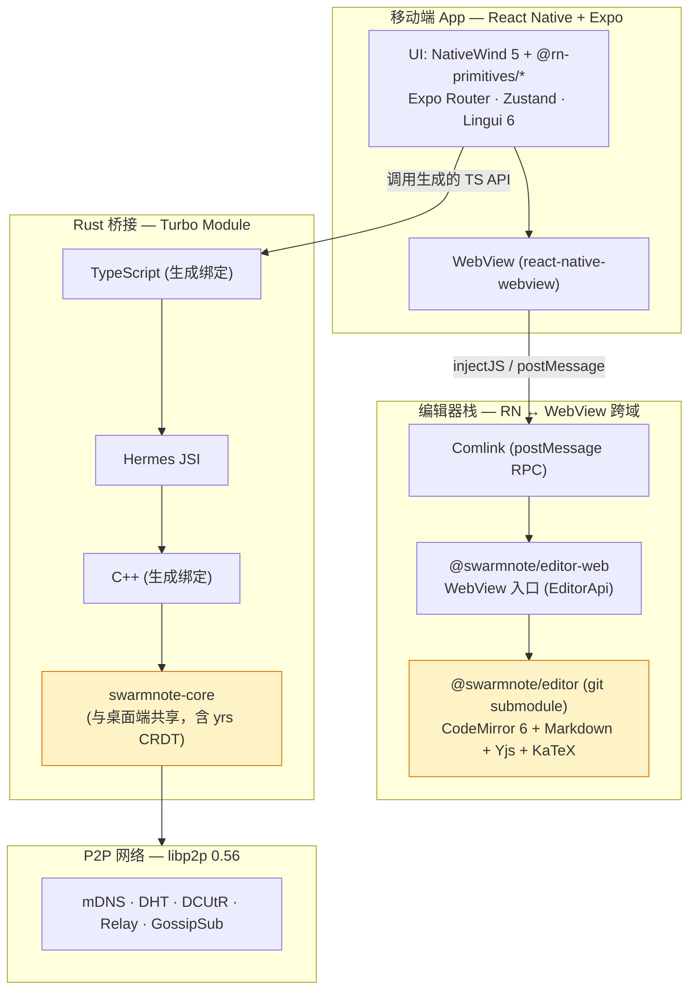

<div align="center">


# SwarmNote Mobile

**把你的设备群带在身上**

*Take your swarm with you.*

[](LICENSE)
[](https://expo.dev)
[](https://reactnative.dev)
[](https://www.nativewind.dev)
[](https://github.com/jhugman/uniffi-bindgen-react-native)

[这是什么](#这是什么) · [开发](#开发) · [架构](#架构) · [路线图](#路线图)

</div>

---

## 这是什么

[SwarmNote](https://github.com/yexiyue/SwarmNote) 的移动端实现——基于 **Expo + React Native**，通过 [`uniffi-bindgen-react-native`](https://github.com/jhugman/uniffi-bindgen-react-native) 桥接 Rust 核心逻辑。

让你的手机加入桌面端组成的 swarm，笔记自动同步过来；离线编辑、回到联网时增量合并。**桌面端和移动端跑同一份 Rust 核心 (`swarmnote-core`)，共享同一份 CRDT 状态机和业务逻辑**。

<table>
<tr>
<td width="25%" align="center">
<h3>📱</h3>
<b>移动伴侣</b><br>
<sub>不是替代桌面<br>是 swarm 的一员</sub>
</td>
<td width="25%" align="center">
<h3>🦀</h3>
<b>Rust 共享核心</b><br>
<sub>与桌面跑同一份 crate<br>uniffi JSI 直调</sub>
</td>
<td width="25%" align="center">
<h3>✏️</h3>
<b>同源编辑器</b><br>
<sub>WebView + CodeMirror 6<br>桌面 / 移动行为一致</sub>
</td>
<td width="25%" align="center">
<h3>🐝</h3>
<b>无缝入群</b><br>
<sub>6 位配对码<br>P2P 与桌面端互通</sub>
</td>
</tr>
</table>

> 目前处于早期开发阶段，未发布预编译版本。需要从源码构建（[开发](#开发)）。

## 与桌面端的对应关系

| 桌面端 (Tauri + React) | 移动端 (Expo + RN) |
|---|---|
| shadcn/ui (Radix + Tailwind 4) | React Native Reusables (`@rn-primitives/*` + NativeWind 5) |
| TanStack Router | Expo Router |
| Zustand stores | Zustand stores（逻辑可复用） |
| `invoke('cmd', args)`（IPC + JSON）| uniffi 直接函数调用（JSI + 类型安全） |
| `app.emit("event")` | uniffi callback interface |
| `swarmnote-core` (path 依赖) | `swarmnote-core` (uniffi-bindgen-rn 桥接) |
| BlockNote ❌（已迁移） | CodeMirror 6 in WebView |

桌面端目前用的也是 CodeMirror 6（封装在 [`@swarmnote/editor`](https://github.com/yexiyue/swarmnote-editor) git submodule 里），移动端通过 WebView 加载同一份编辑器核心——**桌面 / 移动用户拿到完全一致的编辑体验**。

## 开发

### 环境要求

- Node.js 22+ · pnpm 10+
- Rust 工具链（`rustup`）
- Android Studio + Android SDK（Android 开发）
- Xcode 16+（iOS 开发，仅 macOS）

### 初始化

```bash
git clone --recurse-submodules https://github.com/yexiyue/SwarmNote-RN.git
cd SwarmNote-RN
pnpm install
```

> `packages/editor/` 是独立的 [`swarmnote-editor`](https://github.com/yexiyue/swarmnote-editor) git submodule。`--recurse-submodules` 必加，否则编辑器核心不会拉下来。

### Android

```bash
# 1. 安装 Rust Android 交叉编译 targets（首次）
rustup target add aarch64-linux-android armv7-linux-androideabi i686-linux-android x86_64-linux-android

# 2. 编译 Rust 并生成 TS / C++ 绑定
pnpm --filter react-native-swarmnote-core ubrn:android

# 3. 生成原生项目并运行
npx expo prebuild --platform android
npx expo run:android
```

### iOS（仅 macOS）

```bash
# 1. 安装 Rust iOS 交叉编译 targets（首次）
rustup target add aarch64-apple-ios aarch64-apple-ios-sim

# 2. 编译 Rust 并生成 TS / C++ 绑定
pnpm --filter react-native-swarmnote-core ubrn:ios

# 3. 生成原生项目并运行
npx expo prebuild --platform ios
npx expo run:ios
```

### 修改 Rust 代码后

```bash
# 重新编译 + 生成绑定
pnpm --filter react-native-swarmnote-core ubrn:android   # 或 :ios
# 然后重新跑 Expo development build
npx expo run:android                                     # 或 :ios
```

### 修改编辑器核心后

`packages/editor/` 是平台无关的 CodeMirror 6 核心（git submodule）。改动后要重建 WebView bundle：

```bash
pnpm --filter @swarmnote/editor-web build
```

否则 WebView 里仍会加载旧的 bundle。

### Critical Notes

- **不支持 Expo Go**——仓库依赖原生 Rust 模块，必须用 development build (`pnpm android` / `pnpm ios`)
- **`.npmrc` 中 `node-linker=hoisted` 不能删**——Metro 不兼容 pnpm 默认的 symlink node_modules 布局
- **`lightningcss` 锁定 `1.30.1`**（pnpm overrides）——其他版本会让 `src/global.css` 反序列化失败
- **改 `src/global.css` 后必须 `npx expo start --clear`**
- **不要手改生成代码**：`packages/swarmnote-core/{src,cpp}/generated/`（uniffi 自动生成）

## 架构



两条核心链路：

- **编辑器链路** `RN → WebView → Comlink → CodeMirror 6`（无 JSON 序列化，调用 `EditorApi` 类型安全）
- **业务逻辑链路** `TypeScript → Hermes JSI → C++ → Rust`（共享 `swarmnote-core` crate，与桌面端同源）

### 工作区包

`pnpm-workspace.yaml` 包含 3 个工作区：

| 包 | 角色 |
|----|----|
| `react-native-swarmnote-core` | Rust bridge / Turbo Module（uniffi 生成绑定 + Android/iOS native 代码） |
| `@swarmnote/editor` | 平台无关 CodeMirror 6 核心（**git submodule** —— [`yexiyue/swarmnote-editor`](https://github.com/yexiyue/swarmnote-editor)，桌面端也引用同一仓库） |
| `@swarmnote/editor-web` | WebView bundle 入口 + 与 RN 端 Comlink RPC |

### 项目结构

```
swarmnote-mobile/
├── src/
│   ├── app/                       # Expo Router 文件路由
│   ├── components/
│   │   ├── editor/                #   MarkdownEditor + Comlink bridge
│   │   └── ui/                    #   React Native Reusables 生成组件
│   ├── hooks/
│   ├── lib/
│   │   └── comlink-webview-adapter.ts
│   ├── stores/                    # Zustand stores
│   ├── locales/                   # Lingui 翻译
│   └── global.css                 # Tailwind 4 主题变量（CSS-first）
├── packages/
│   ├── editor/                    # @swarmnote/editor (git submodule)
│   ├── editor-web/                # @swarmnote/editor-web (WebView 入口)
│   └── swarmnote-core/            # react-native-swarmnote-core (Rust bridge)
│       ├── ubrn.config.yaml       #   uniffi 构建配置
│       ├── rust/mobile-core/      #   Rust crate (#[uniffi::export])
│       ├── src/generated/         #   ubrn 生成的 TS 绑定（不要手改）
│       ├── cpp/generated/         #   ubrn 生成的 C++ JSI 绑定（不要手改）
│       └── android/               #   Android 原生代码 + .a 静态库
├── plugins/                        # Expo config plugins
├── assets/                         # 图片、字体、icon
├── dev-notes/                      # 开发笔记 + 知识库
└── milestones/                     # 版本规划
```

## 技术栈

| 层级 | 技术 |
|------|------|
| 框架 | Expo SDK 55 · React Native 0.83 · React 19.2 |
| 路由 | Expo Router（文件路由 · `typedRoutes` + `reactCompiler`） |
| 样式 | NativeWind 5 + Tailwind CSS 4（CSS-first，无 `tailwind.config.js`） |
| UI 组件 | [React Native Reusables](https://github.com/founded-labs/react-native-reusables) (`@rn-primitives/*`) |
| 状态管理 | Zustand 5 |
| 国际化 | Lingui 6（zh 源语言，en 翻译） |
| 编辑器 | CodeMirror 6 + Yjs in WebView via Comlink |
| Rust 桥接 | uniffi-bindgen-react-native 0.31（JSI Turbo Module） |
| 跨平台核心 | `swarmnote-core` crate（与桌面端共享） |
| 工具链 | Biome · Lefthook · commitlint · git-cliff |

## 设计稿

设计稿位于 `dev-notes/design/mobile-design.pen`（[Pencil](https://withpencil.app/) 文件，需通过 Pencil MCP 工具读取，不是普通 Markdown）。

## Swarm 生态

| 项目 | 说明 | 状态 |
|------|------|------|
| [SwarmDrop](https://github.com/yexiyue/swarmdrop) | P2P 文件传输 | v0.4.4 |
| [SwarmNote](https://github.com/yexiyue/SwarmNote) | P2P 笔记同步（桌面端） | v0.2.3 |
| **SwarmNote-RN** | SwarmNote 移动端（本仓库） | 开发中 |
| [swarm-p2p-core](https://github.com/yexiyue/swarm-p2p) | P2P 网络 SDK | 已完成 |

## 路线图

- [x] **Phase 1** — UI 壳 + Rust 桥接验证（uniffi hello world · Tab 导航 · WebView 编辑器跑通）
- [ ] **Phase 2** — 功能串联（工作区管理 · 文档列表 · 身份管理）
- [ ] **Phase 3** — 核心能力（P2P 同步 · 设备配对 · CRDT 状态持久化）
- [ ] **Phase 4** — 与桌面端互通验证 + 首个 alpha 发布
- [ ] **Phase 5** — 应用商店上架（Google Play · App Store）

## 许可证

[MIT](LICENSE) &copy; 2025 SwarmNote Contributors

---

<div align="center">
<sub>Built with <a href="https://expo.dev">Expo</a> · <a href="https://reactnative.dev">React Native</a> · <a href="https://github.com/jhugman/uniffi-bindgen-react-native">uniffi-bindgen-rn</a> · <a href="https://codemirror.net">CodeMirror 6</a> · <a href="https://yjs.dev">Yjs</a></sub>
</div>
