# CodeMirror 6 深度指南：从零理解如何构建一个 Obsidian 级编辑器

> 本文基于 SwarmNote（我们的项目）和 Joplin（成熟参考）的真实代码，全面讲解用 CM6 构建 Markdown 编辑器的每一个技术层面。不追求"教科书式完整"，而是聚焦"做一个好用的笔记编辑器"需要掌握的核心知识。

## 目录

1. [CM6 到底是什么？和传统编辑器有什么不同](#1-cm6-到底是什么)
2. [核心概念：State、View、Transaction](#2-核心概念statetransaction-和-view)
3. [Extension 系统：CM6 的灵魂](#3-extension-系统cm6-的灵魂)
4. [Markdown 语法解析：Lezer 语法树](#4-markdown-语法解析lezer-语法树)
5. [Decoration 系统：让纯文本变好看](#5-decoration-系统让纯文本变好看)
6. [Live Preview：Widget 替换与 Reveal Strategy](#6-live-previewwidget-替换与-reveal-strategy)
7. [命令系统：操控编辑器](#7-命令系统操控编辑器)
8. [动态设置：Compartment 运行时重配](#8-动态设置compartment-运行时重配)
9. [主题系统：颜色、字体、样式](#9-主题系统颜色字体样式)
10. [搜索系统：StateEffect 驱动的搜索面板](#10-搜索系统stateeffect-驱动的搜索面板)
11. [yjs 协作：字符级 CRDT](#11-yjs-协作字符级-crdt)
12. [移动端集成：WebView + Comlink RPC](#12-移动端集成webview--comlink-rpc)
13. [性能：为什么 CM6 能处理大文档](#13-性能为什么-cm6-能处理大文档)
14. [完整架构图](#14-完整架构图)

---

## 1. CM6 到底是什么？

CodeMirror 6 是一个**从头重写**的代码/文本编辑器框架。和 CM5、Monaco、ProseMirror 的关键区别：

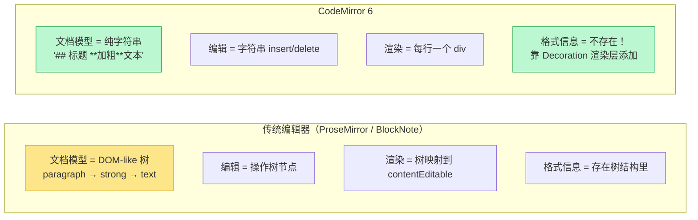

**这意味着什么？**

- 文档永远是纯文本（Markdown 源码）
- 你看到的"大标题""加粗"都是 CSS 装饰，不改变底层文本
- 输入法（IME）只需要往一个扁平字符串里插字符，不需要处理嵌套 DOM
- 这就是为什么 CM6 在移动端中文输入上比 ProseMirror 稳定得多

---

## 2. 核心概念：State、Transaction 和 View

CM6 的数据流是**单向的**，类似 React/Redux：

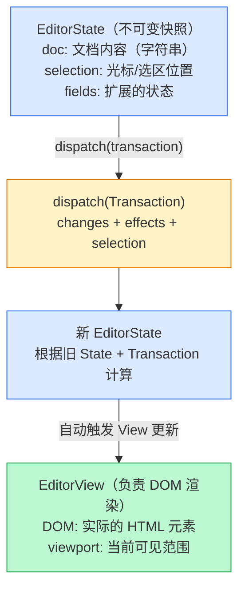

**用代码理解**：

```typescript
// 1. 创建初始状态
const state = EditorState.create({
  doc: "# Hello\n\nWorld",  // 文档就是字符串
  extensions: [/* 稍后详解 */],
});

// 2. 创建视图（挂载到 DOM）
const view = new EditorView({
  state,
  parent: document.getElementById('editor-root'),
});

// 3. 修改文档 = dispatch 一个 Transaction
view.dispatch({
  // 把位置 0-7 的 "# Hello" 替换成 "## Hi"
  changes: { from: 0, to: 7, insert: "## Hi" },
});

// 4. State 是不可变的
//    dispatch 后 view.state 是一个全新的对象
//    旧的 state 不会被修改
```

**关键心智模型**：你永远不直接修改 State。你描述"要做什么变化"（Transaction），CM6 帮你算出新 State。

---

## 3. Extension 系统：CM6 的灵魂

CM6 的所有功能——语法高亮、快捷键、搜索、自动补全——都是 Extension。CM6 核心本身几乎什么都不做，一切能力来自扩展。

### Extension 的六种形态

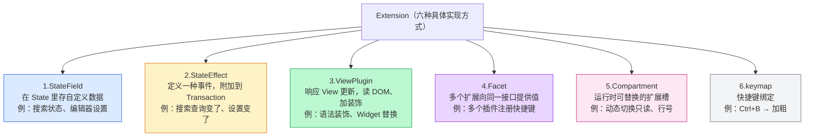

### 它们如何在 createEditor 中组合

下面是 SwarmNote 的 `createEditor.ts`，展示了这些扩展如何组装：

```typescript
export function createEditor(parent: HTMLElement, props: EditorProps): EditorControl {
  const { initialText, settings, collaboration, onEvent } = props;

  // ① Compartment 系统——运行时可重配的设置
  const settingsRuntime = createEditorSettingsExtension(settings);

  // ② 组装扩展数组——这是 CM6 的核心
  const extensions: Extension[] = [
    // 基础能力
    history(),                           // 撤销/重做栈
    drawSelection(),                     // 绘制选区高亮
    dropCursor(),                        // 拖拽时显示光标

    // Markdown 语言支持
    markdown({ base: markdownLanguage, extensions: [...] }),
    syntaxHighlighting(classHighlighter), // 语法高亮

    // 自定义扩展（按 feature toggle 加载）
    settingsRuntime.extension,            // Compartment 设置
    ...(settings.features.markdownDecorations
      ? [createMarkdownDecorationExtension()] : []),
    ...(settings.features.inlineRendering
      ? [createInlineRenderingExtension()] : []),
    ...(settings.features.collaboration
      ? createCollaborationExtension(collaboration) : []),

    // 快捷键
    keymap.of([...standardKeymap, ...historyKeymap]),
  ];

  // ③ 创建 View
  const view = new EditorView({
    state: EditorState.create({ doc: initialText, extensions }),
    parent,
  });

  // ④ 返回控制接口
  return new EditorControlImpl(view, { settingsRuntime });
}
```

**理解要点**：

- Extensions 是一个**扁平数组**，CM6 会自动处理它们之间的依赖
- 顺序通常不重要（除了 `keymap`，后面的优先级更低）
- 可以用 `...条件 ? [ext] : []` 做条件加载
- 一个 Extension 可以是另一个 Extension 数组（递归展开）

---

## 4. Markdown 语法解析：Lezer 语法树

CM6 用 **Lezer** 做语法解析。Lezer 会把文档解析成一棵语法树（AST），后续的装饰、格式检测、Widget 替换全部依赖这棵树。

### 语法树长什么样

对于这段 Markdown：

```markdown
## 标题

**加粗**文本

- [ ] 任务
- 列表项
```

Lezer 解析出的语法树：

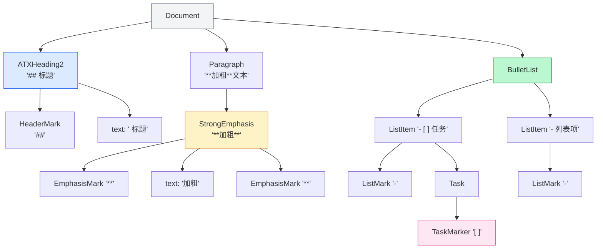

### 如何遍历语法树

CM6 提供两种遍历方式：

**方式一：从根向下遍历（处理 viewport 内的装饰）**

```typescript
import { ensureSyntaxTree } from '@codemirror/language';

function computeDecorations(view: EditorView): DecorationSet {
  // 只遍历可见范围——性能关键
  for (const { from, to } of view.visibleRanges) {
    ensureSyntaxTree(view.state, to)?.iterate({
      from, to,
      enter(node) {
        // node.name = "ATXHeading2", "EmphasisMark", "TaskMarker" 等
        // node.from, node.to = 在文档中的字符位置
        console.log(node.name, node.from, node.to);
      },
    });
  }
}
```

**方式二：从光标位置向上遍历（检测当前格式）**

```typescript
function computeSelectionFormatting(state: EditorState): SelectionFormatting {
  const pos = state.selection.main.from;
  const tree = ensureSyntaxTree(state, pos);

  // resolveInner 找到 pos 处最深的节点，然后向上走
  let node = tree.resolveInner(pos, -1);
  while (node) {
    switch (node.name) {
      case 'StrongEmphasis': result.bold = true; break;
      case 'Emphasis': result.italic = true; break;
      case 'ATXHeading2': result.heading = 2; break;
      case 'BulletList': result.listType = 'unordered'; break;
      // ...
    }
    node = node.parent; // 向上遍历
  }
}
```

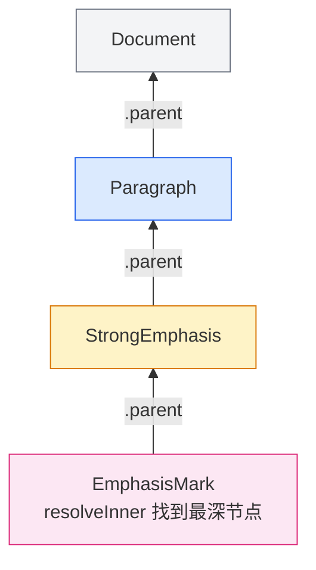

**理解要点**：

- `ensureSyntaxTree` 确保语法树解析到你需要的位置（增量解析，不是一次解析整个文档）
- `iterate` 适合"遍历一片区域的所有节点"
- `resolveInner` + `parent` 适合"从某个点找出它所在的所有上下文"

---

## 5. Decoration 系统：让纯文本变好看

CM6 的文档是纯文本，视觉效果全靠 **Decoration（装饰）** 实现。装饰不改变文档内容，只影响渲染。

### 三种 Decoration

```mermaid
graph TD
    subgraph "1.Line Decoration（行装饰）"
        L1["给整行加 CSS class"]
        L2["Decoration.line 属性: class='cm-h1'"]
        L3["效果：标题文字 → 字体变大加粗"]
    end

    subgraph "2.Mark Decoration（标记装饰）"
        M1["给一段文本范围加 CSS class"]
        M2["Decoration.mark 属性: class='cm-inlineCode'"]
        M3["效果：code → 灰色背景 + 等宽字体"]
    end

    subgraph "3.Widget Decoration（部件装饰）"
        W1["用自定义 DOM 元素替换文本"]
        W2["Decoration.replace widget: CheckboxWidget"]
        W3["效果：任务列表 → ☐ 买菜"]
    end

    L1 --> L2 --> L3
    M1 --> M2 --> M3
    W1 --> W2 --> W3

    style L3 fill:#dbeafe,stroke:#2563eb
    style M3 fill:#fef3c7,stroke:#d97706
    style W3 fill:#bbf7d0,stroke:#16a34a
```

### 如何通过 ViewPlugin 添加装饰

SwarmNote 的 `markdownDecorationExtension.ts` 就是一个典型的装饰 ViewPlugin：

```typescript
// 1. 定义节点名 → 装饰的映射
const lineDecorations: Record<string, Decoration> = {
  ATXHeading1: Decoration.line({ attributes: { class: 'cm-h1 cm-headerLine' } }),
  ATXHeading2: Decoration.line({ attributes: { class: 'cm-h2 cm-headerLine' } }),
  FencedCode:  Decoration.line({ attributes: { class: 'cm-codeBlock' } }),
  Blockquote:  Decoration.line({ attributes: { class: 'cm-blockQuote' } }),
  // ...
};

const markDecorations: Record<string, Decoration> = {
  InlineCode: Decoration.mark({ attributes: { class: 'cm-inlineCode' } }),
  URL:        Decoration.mark({ attributes: { class: 'cm-url' } }),
  // ...
};

// 2. 创建 ViewPlugin
const plugin = ViewPlugin.fromClass(
  class {
    decorations: DecorationSet;

    constructor(view: EditorView) {
      this.decorations = computeDecorations(view);
    }

    // 3. 何时重新计算——文档变了或视口滚动了
    update(update: ViewUpdate) {
      if (update.docChanged || update.viewportChanged) {
        this.decorations = computeDecorations(update.view);
      }
    }
  },
  { decorations: (v) => v.decorations },  // 4. 告诉 CM6 从哪读装饰
);

// 5. 计算装饰的核心函数
function computeDecorations(view: EditorView): DecorationSet {
  const entries = [];

  for (const { from, to } of view.visibleRanges) {
    ensureSyntaxTree(view.state, to)?.iterate({
      from, to,
      enter(node) {
        // 查表：这个语法节点需要什么装饰？
        const lineDeco = lineDecorations[node.name];
        if (lineDeco) {
          // 给该节点跨越的每一行加装饰
          entries.push({ from: lineStart, to: lineStart, decoration: lineDeco });
        }

        const markDeco = markDecorations[node.name];
        if (markDeco) {
          entries.push({ from: node.from, to: node.to, decoration: markDeco });
        }
      },
    });
  }

  // 排序（CM6 要求装饰按位置排列）+ 构建
  entries.sort((a, b) => a.from - b.from);
  const builder = new RangeSetBuilder<Decoration>();
  for (const e of entries) builder.add(e.from, e.to, e.decoration);
  return builder.finish();
}
```

**配合 CSS 产生效果**：

```typescript
const markdownTheme = EditorView.theme({
  '.cm-headerLine': { fontWeight: '700' },
  '.cm-h1': { fontSize: '1.6em' },
  '.cm-h2': { fontSize: '1.4em' },
  '.cm-inlineCode': {
    backgroundColor: 'rgba(127, 127, 127, 0.12)',
    borderRadius: '4px',
    fontFamily: 'monospace',
  },
  '.cm-codeBlock': {
    backgroundColor: 'rgba(127, 127, 127, 0.08)',
  },
  '.cm-blockQuote': {
    borderLeft: '3px solid rgba(127, 127, 127, 0.35)',
    paddingLeft: '12px',
  },
});
```

**最终效果**：

```text
没有装饰:     ## 标题         (普通文本，16px)
有行装饰:     ## 标题         (class="cm-h1", 加粗, 1.6em)

没有装饰:     `code`         (普通文本)
有标记装饰:   `code`         (class="cm-inlineCode", 灰色背景, 等宽字体)
```

---

## 6. Live Preview：Widget 替换与 Reveal Strategy

这是让编辑器从"代码编辑器"变成"Obsidian 式笔记体验"的核心技术。

### 基本原理

```text
纯文本:       - [ ] 买菜
第 5 章装饰:   - [ ] 买菜     (cm-listItem class, 有缩进)
Live Preview: ☐ 买菜         ("- [ ]" 被 Widget 替换了)

纯文本:       **加粗**文本
第 5 章装饰:   **加粗**文本    (cm-headerLine class)
Live Preview:  加粗文本       ("**" 被隐藏了，文字显示加粗)
```

### Widget 类

Widget 是一个 DOM 元素，用来替换文档中的某段文本。下面是 CheckboxWidget 的实现：

```typescript
class CheckboxWidget extends WidgetType {
  constructor(
    private readonly checked: boolean,
    private readonly pos: number,  // "[ ]" 在文档中的位置
  ) { super(); }

  // 告诉 CM6 什么情况下可以复用旧 Widget（性能优化）
  eq(other: CheckboxWidget): boolean {
    return this.checked === other.checked && this.pos === other.pos;
  }

  // 创建实际的 DOM 元素
  toDOM(view: EditorView): HTMLElement {
    const input = document.createElement('input');
    input.type = 'checkbox';
    input.checked = this.checked;

    // 点击时修改文档（[ ] ↔ [x]）
    input.addEventListener('mousedown', (e) => {
      e.preventDefault();
      view.dispatch({
        changes: {
          from: this.pos,
          to: this.pos + 3,
          insert: this.checked ? '[ ]' : '[x]',
        },
      });
    });

    return input;
  }

  // 允许 Widget 内的事件通过
  ignoreEvent(): boolean { return true; }
}
```

### Reveal Strategy：光标靠近时显示原始 Markdown

这是 Live Preview 的精髓——平时显示 Widget，光标移到那一行时恢复原始 Markdown，让用户可以编辑。

```text
光标在第 1 行:    ☐ 买菜           ← Widget 显示
                 ● 列表项          ← Widget 显示

光标移到第 2 行:   ☐ 买菜           ← Widget 显示
                 - 列表项          ← 原始 Markdown 恢复！

光标移走:         ☐ 买菜           ← Widget 恢复
                 ● 列表项          ← Widget 恢复
```

**三种 reveal 策略**：

```typescript
function shouldReveal(
  state: EditorState,
  from: number,       // 装饰的起始位置
  to: number,         // 装饰的结束位置
  strategy: 'line' | 'select' | 'active' | boolean,
): boolean {
  const cursor = state.selection.main;

  switch (strategy) {
    case 'line':
      // 光标在同一行 → 显示原始 Markdown
      const cursorLine = state.doc.lineAt(cursor.head).number;
      const decoLine = state.doc.lineAt(from).number;
      return cursorLine === decoLine;

    case 'select':
      // 选区与装饰范围有交集 → 显示原始
      return cursor.from < to && cursor.to > from;

    case 'active':
      // 光标在装饰范围内部 → 显示原始
      return cursor.head >= from && cursor.head <= to;
  }
}
```

**不同元素用不同策略**：

| 元素 | Reveal 策略 | 原因 |
| ---- | ----------- | ---- |
| ● 列表标记 | `'line'` | 光标在同行就该能编辑 |
| `---` 分隔线 | `'line'` | 同上 |
| ☐ 复选框 | `'active'` | 要在 `[ ]` 里才需要编辑 |
| `##` 标题标记 | `'line'` | 光标在标题行就显示 ## |
| `**` 加粗标记 | `'active'` | 光标在加粗文字里才显示 |

### makeInlineReplaceExtension 工厂函数

这是整个渲染系统的引擎——一个通用的 ViewPlugin 工厂，接收"替换规格"列表，自动处理遍历语法树、创建 Widget、判断 reveal：

```typescript
function makeInlineReplaceExtension(specs: InlineRenderingSpec[]): Extension {
  // 1. 构建查找表：语法节点名 → 替换规格
  const specMap = new Map<string, ReplacementExtension>();
  for (const spec of specs) {
    for (const name of spec.nodeNames) {
      specMap.set(name, spec.extension);
    }
  }

  return ViewPlugin.fromClass(class {
    decorations: DecorationSet;

    constructor(view: EditorView) {
      this.decorations = this.buildDecorations(view);
    }

    // ★ 关键：selectionSet 也要触发重建（否则 reveal 不工作）
    update(update: ViewUpdate) {
      if (update.docChanged || update.viewportChanged || update.selectionSet) {
        this.decorations = this.buildDecorations(update.view);
      }
    }

    buildDecorations(view: EditorView): DecorationSet {
      const entries = [];
      const parentTags = new Map<string, number>(); // 跟踪嵌套深度

      for (const { from, to } of view.visibleRanges) {
        ensureSyntaxTree(view.state, to)?.iterate({
          from, to,
          enter(node) {
            // 维护嵌套计数（BulletList 嵌套 BulletList → depth 递增）
            parentTags.set(node.name, (parentTags.get(node.name) ?? 0) + 1);

            const spec = specMap.get(node.name);
            if (!spec) return;

            // 判断是否应该 reveal（显示原始 Markdown）
            const strategy = spec.getRevealStrategy?.(node, view.state) ?? 'line';
            if (shouldReveal(view.state, node.from, node.to, strategy)) {
              return; // 跳过——显示原始文本
            }

            // 创建 Widget 或 Decoration
            const result = spec.createDecoration(node, view.state, parentTags);
            if (result instanceof WidgetType) {
              entries.push({
                from: node.from, to: node.to,
                decoration: Decoration.replace({ widget: result }),
              });
            }
          },
          leave(node) {
            // 离开节点，递减嵌套计数
            const d = parentTags.get(node.name)!;
            d <= 1 ? parentTags.delete(node.name) : parentTags.set(node.name, d - 1);
          },
        });
      }

      // 排序 + 构建
      entries.sort((a, b) => a.from - b.from);
      return Decoration.set(entries.map(e =>
        e.decoration.range(e.from, e.to)
      ));
    }
  }, { decorations: v => v.decorations });
}
```

**使用时只需定义"规格"**：

```typescript
// "看到 TaskMarker 节点时，替换成 CheckboxWidget"
const replaceCheckboxes: InlineRenderingSpec = {
  nodeNames: ['TaskMarker'],
  extension: {
    createDecoration(node, state) {
      const checked = /\[[xX]\]/.test(state.sliceDoc(node.from, node.to));
      return new CheckboxWidget(checked, node.from);
    },
    getRevealStrategy() { return 'active'; },
  },
};

// "看到 BulletList 里的 ListMark 时，替换成圆点 Widget"
const replaceBulletLists: InlineRenderingSpec = {
  nodeNames: ['ListMark'],
  extension: {
    createDecoration(node, state, parentTags) {
      if ((parentTags.get('BulletList') ?? 0) === 0) return null; // 跳过有序列表
      return new BulletWidget(parentTags.get('BulletList')! - 1);
    },
    getRevealStrategy() { return 'line'; },
  },
};
```

---

## 7. 命令系统：操控编辑器

命令就是"对编辑器做一件事"的函数。本质上都是构造 Transaction 然后 dispatch。

### 简单命令：toggleBold

```typescript
function toggleInlineMarker(view: EditorView, marker: string): void {
  const { from, to } = view.state.selection.main;
  const selected = view.state.sliceDoc(from, to);
  const len = marker.length;

  // 检查选中文本前后是否已有标记
  const before = view.state.sliceDoc(Math.max(0, from - len), from);
  const after = view.state.sliceDoc(to, to + len);

  if (before === marker && after === marker) {
    // 已有标记 → 删除
    view.dispatch({
      changes: [
        { from: from - len, to: from, insert: '' },
        { from: to, to: to + len, insert: '' },
      ],
    });
  } else {
    // 没有标记 → 添加
    view.dispatch({
      changes: { from, to, insert: `${marker}${selected}${marker}` },
    });
  }
}

// 使用
function toggleBold(view: EditorView) { toggleInlineMarker(view, '**'); }
function toggleItalic(view: EditorView) { toggleInlineMarker(view, '*'); }
function toggleCode(view: EditorView) { toggleInlineMarker(view, '`'); }
```

### 复杂命令：toggleList

列表切换需要处理多行选区、列表类型检测、缩进：

```typescript
function toggleList(view: EditorView, targetType: ListType): void {
  const { from, to } = view.state.selection.main;
  const fromLine = view.state.doc.lineAt(from);
  const toLine = view.state.doc.lineAt(to);
  const changes = [];

  // 遍历选区内的每一行
  for (let pos = fromLine.from; pos <= toLine.to; ) {
    const line = view.state.doc.lineAt(pos);
    const detected = detectListType(line.text); // 用正则检测当前行是什么列表

    if (detected?.type === targetType) {
      // 同类型 → 移除列表标记
      changes.push({ from: ..., to: ..., insert: '' });
    } else if (detected) {
      // 不同类型 → 切换（"- item" → "1. item"）
      changes.push({ from: ..., to: ..., insert: makePrefix(targetType) });
    } else {
      // 不是列表 → 添加标记
      changes.push({ from: ..., to: ..., insert: makePrefix(targetType) });
    }
    pos = line.to + 1;
  }

  view.dispatch({ changes });
}
```

### 格式检测：computeSelectionFormatting

工具栏需要知道"光标当前处于什么格式中"才能高亮对应按钮：

```typescript
// 光标在 "**加粗**" 里面 → { bold: true }
// 光标在 "## 标题" 里面 → { heading: 2 }
// 光标在 "- [ ] 任务" 里面 → { listType: 'check' }

function computeSelectionFormatting(state: EditorState): SelectionFormatting {
  let node = tree.resolveInner(cursor, -1); // 最深节点
  while (node) {
    // 逐层向上，累积格式信息
    if (node.name === 'StrongEmphasis') result.bold = true;
    if (node.name === 'BulletList') { result.listType = 'unordered'; result.listLevel++; }
    node = node.parent;
  }
}
```

---

## 8. 动态设置：Compartment 运行时重配

CM6 的 Extensions 一旦创建就不能修改。但有些设置（只读模式、行号、拼写检查）需要在运行时切换。**Compartment** 就是为此设计的。

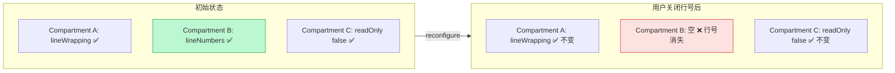

**代码实现**：

```typescript
// 创建阶段：每个可变设置一个 Compartment
const compartments = {
  editable: new Compartment(),
  lineNumbers: new Compartment(),
  lineWrapping: new Compartment(),
  readOnly: new Compartment(),
  tabSize: new Compartment(),
};

// 初始化时用 compartment.of() 包裹扩展
const extension = [
  compartments.lineWrapping.of(EditorView.lineWrapping),
  compartments.lineNumbers.of(lineNumbers()),
  compartments.readOnly.of(EditorState.readOnly.of(false)),
];

// 运行时切换：用 compartment.reconfigure() 生成 StateEffect
function updateSettings(view: EditorView, newSettings: EditorSettings) {
  view.dispatch({
    effects: [
      compartments.lineWrapping.reconfigure(
        newSettings.lineWrapping ? EditorView.lineWrapping : []
      ),
      compartments.lineNumbers.reconfigure(
        newSettings.showLineNumbers ? lineNumbers() : []
      ),
      compartments.readOnly.reconfigure(
        EditorState.readOnly.of(newSettings.readonly)
      ),
    ],
  });
}
```

**理解要点**：Compartment 本质上是一个"扩展槽"，你可以在运行时把里面的扩展换成另一个（或换成空数组来禁用）。

---

## 9. 主题系统：颜色、字体、样式

CM6 的主题就是 CSS，但通过 `EditorView.theme()` 生成带作用域的样式，避免全局污染。

### 基本用法

```typescript
const myTheme = EditorView.theme({
  // & 代表 .cm-editor 根元素
  '&': {
    color: '#333',
    backgroundColor: '#fff',
    fontFamily: '-apple-system, BlinkMacSystemFont, sans-serif',
    fontSize: '16px',
  },

  // .cm-content 是编辑区域
  '& .cm-content': {
    lineHeight: '1.6',
    paddingBottom: '50vh',   // 底部留白，方便滚动
    maxWidth: '720px',       // 限制内容宽度
    margin: '0 auto',
  },

  // 光标样式
  '& .cm-cursor': {
    borderLeftColor: '#333',
  },

  // 选区样式
  '&.cm-focused .cm-selectionBackground': {
    backgroundColor: 'rgba(59, 130, 246, 0.2)',
  },
});
```

### 语法高亮样式

```typescript
import { HighlightStyle, syntaxHighlighting } from '@codemirror/language';
import { tags } from '@lezer/highlight';

const highlightStyle = HighlightStyle.define([
  { tag: tags.strong, fontWeight: 'bold' },
  { tag: tags.emphasis, fontStyle: 'italic' },
  { tag: tags.link, color: '#2563eb', textDecoration: 'underline' },
  { tag: tags.monospace, fontFamily: 'monospace', backgroundColor: 'rgba(0,0,0,0.05)' },
  { tag: tags.strikethrough, textDecoration: 'line-through' },
  { tag: tags.heading1, fontSize: '1.6em', fontWeight: 'bold' },
  { tag: tags.heading2, fontSize: '1.4em', fontWeight: 'bold' },
]);

// 作为 Extension 使用
const themeExtension = [myTheme, syntaxHighlighting(highlightStyle)];
```

### Joplin 的做法：从设置动态生成主题

```typescript
// Joplin 的 theme.ts
function createTheme(theme: EditorTheme): Extension[] {
  const isDark = theme.appearance === 'dark';

  return [
    EditorView.theme({
      '& .cm-content': {
        fontFamily: theme.fontFamily,
        fontSize: `${theme.fontSize}${theme.fontSizeUnits ?? 'px'}`,
      },
      '& .cm-h1': {
        fontSize: '1.5em',
        borderBottom: `1px solid ${theme.dividerColor}`,
      },
      '& .cm-inlineCode': {
        borderColor: isDark ? 'rgba(200,200,200,0.5)' : 'rgba(100,100,100,0.5)',
      },
    }, { dark: isDark }),  // ← 告诉 CM6 这是深色主题
  ];
}
```

---

## 10. 搜索系统：StateEffect 驱动的搜索面板

SwarmNote 的搜索系统展示了 StateEffect 的高级用法——搜索 UI 在编辑器外部（RN 侧），但搜索状态在 CM6 内部管理。

### 架构

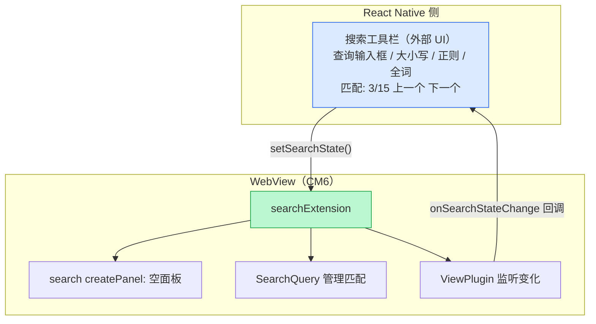

### 核心代码

```typescript
// 创建搜索扩展，面板用一个空 div 代替（UI 在 RN 侧）
function createSearchExtension(options: SearchExtensionOptions): Extension {
  return [
    search({
      createPanel: () => {
        const dom = document.createElement('div');
        return { dom, mount() {}, destroy() {} };
      },
    }),
    // ViewPlugin 监听搜索状态变化
    ViewPlugin.fromClass(class {
      update(update: ViewUpdate) {
        if (shouldEmitSearchStateChange(update)) {
          const nextState = getSearchState(update.state);
          options.onSearchStateChange?.(nextState);
        }
      }
    }),
  ];
}

// 从外部设置搜索
function setSearchState(view: EditorView, state: SearchState | null): void {
  const query = new SearchQuery({
    search: state?.query ?? '',
    caseSensitive: state?.caseSensitive ?? false,
    // ...
  });
  view.dispatch({ effects: [setSearchQuery.of(query)] });

  // 打开或关闭搜索面板（虽然面板是空的，但 CM6 内部需要）
  if (state?.isOpen) openSearchPanel(view);
  else closeSearchPanel(view);
}
```

---

## 11. yjs 协作：字符级 CRDT

SwarmNote 使用 `y-codemirror.next`（yjs 作者维护）做实时协作。这是 Joplin 没有的能力。

### 数据流

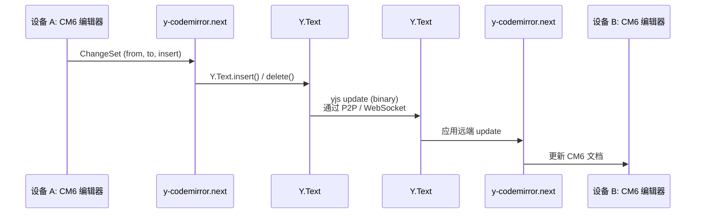

### 代码

```typescript
// 1. CM6 侧：一行代码绑定
import { yCollab } from 'y-codemirror.next';

function createCollaborationExtension(config: EditorCollaborationConfig): Extension[] {
  const ydoc = config.ydoc as Y.Doc;
  const ytext = ydoc.getText(config.fragmentName ?? 'document');
  return [yCollab(ytext, null)]; // null = 不用 Awareness（光标同步）
}

// 2. WebView 侧：监听本地更新，发给 RN
ydoc.on('update', (update: Uint8Array, origin: unknown) => {
  if (origin === 'remote') return; // 跳过远端来的更新
  emitEditorEvent({
    kind: EditorEventType.CollaborationUpdate,
    update,
  });
});

// 3. RN 侧：收到远端更新，应用到 WebView
function applyRemoteUpdate(update: Uint8Array) {
  Y.applyUpdate(ydoc, update, 'remote'); // 标记为 remote，防止循环
}
```

**关键**：`y-codemirror.next` 自动把 CM6 的 `ChangeSet`（字符级插入/删除）翻译成 yjs 的 `Y.Text` 操作，反过来也一样。整个协作几乎零代码。

---

## 12. 移动端集成：WebView + Comlink RPC

移动端不能直接跑 CM6（需要真实 DOM），所以用 WebView 承载编辑器，通过 Comlink 做类型安全的 RPC 通信。

### 架构

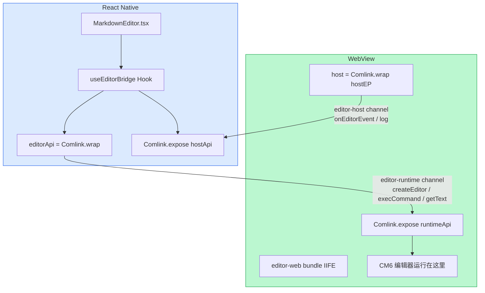

### Channel 路由

WebView 的 `postMessage` 只有一条通道，但我们需要两个方向的 RPC。用 **channel envelope** 做多路复用：

```typescript
// 每条消息都包装成 { channel, payload }
type ComlinkEnvelope = { channel: string; payload: unknown };

// RN → WebView (runtime channel): "调用编辑器方法"
{ channel: "editor-runtime", payload: /* Comlink 的 RPC 消息 */ }

// WebView → RN (host channel): "编辑器事件回调"
{ channel: "editor-host", payload: /* Comlink 的 RPC 消息 */ }
```

**Endpoint 适配器**把 WebView 的 `injectJavaScript` / `onMessage` 包装成 Comlink 期望的 `postMessage` / `addEventListener` 接口：

```typescript
function createRNEndpoint(channel: string, getWebView: () => WebViewRef | null): Endpoint {
  return {
    // RN → WebView: 注入 JS 触发 MessageEvent
    postMessage(msg) {
      const serialized = JSON.stringify({ channel, payload: msg });
      getWebView()?.injectJavaScript(`
        window.dispatchEvent(new MessageEvent('message', { data: ${serialized} }));
        true;
      `);
    },

    // WebView → RN: 从 onMessage 分发
    addEventListener(type, handler) { listeners.add(handler); },

    // 被 onMessage 调用，只处理自己 channel 的消息
    dispatchMessage(data) {
      const envelope = parseEnvelope(data);
      if (envelope?.channel !== channel) return;
      for (const h of listeners) h({ data: envelope.payload });
    },
  };
}
```

---

## 13. 性能：为什么 CM6 能处理大文档

CM6 有几个关键的性能设计：

### Viewport 渲染

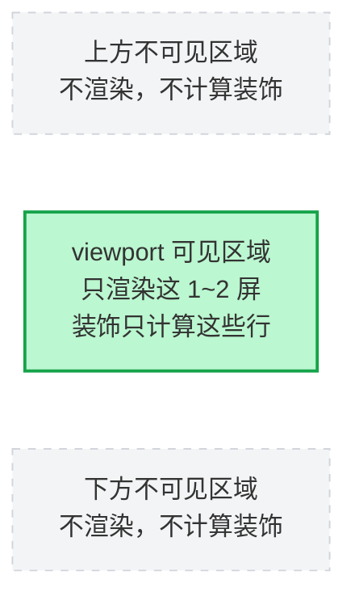

代码中体现为 `view.visibleRanges`：

```typescript
// 只遍历可见范围内的语法树
for (const { from, to } of view.visibleRanges) {
  ensureSyntaxTree(view.state, to)?.iterate({ from, to, ... });
}
```

### 增量解析

Lezer 语法树是**增量更新**的。用户打一个字，只重新解析受影响的部分，不是整个文档：

```text
文档: "## 标题\n\n普通文本\n\n**加粗**"
用户在 "普通" 后面打了 "！"

增量解析只处理:  "普通！文本" 这一行
不需要重新解析:  "## 标题" 和 "**加粗**"
```

### 不可变数据结构

EditorState 使用不可变的 rope-like 数据结构存储文档。这意味着：
- 撤销/重做几乎零成本（保留旧 State 引用）
- 大文档的编辑不需要复制整个字符串

### 装饰排序的 RangeSet

`DecorationSet` 内部使用 B-tree 结构（`RangeSet`），支持高效的：
- 按位置范围查询
- 增量更新（`map` 方法可以在文档变化后调整位置）
- 合并多个插件的装饰

---

## 14. 完整架构图

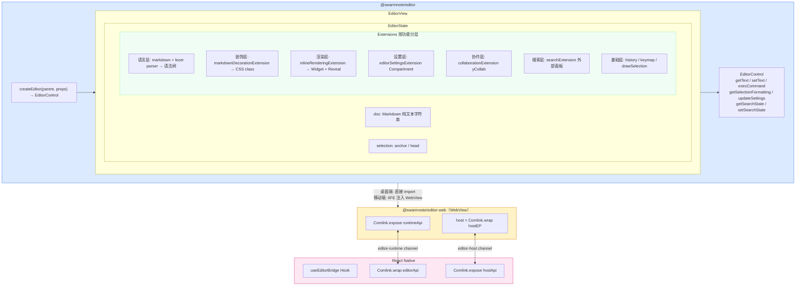

---

## 总结：构建一个好编辑器需要理解什么

| 层次 | 你需要理解的 | 对应章节 |
|------|------------|---------|
| **数据模型** | 文档是纯文本，不是 DOM 树 | §1, §2 |
| **状态管理** | State 不可变，通过 Transaction 更新 | §2 |
| **扩展系统** | 一切功能都是 Extension | §3 |
| **语法解析** | Lezer 语法树是装饰和命令的基础 | §4 |
| **视觉效果** | Decoration 的三种形态 | §5 |
| **Live Preview** | Widget 替换 + Reveal Strategy | §6 |
| **编辑操作** | 命令 = 构造 Transaction 然后 dispatch | §7 |
| **动态配置** | Compartment 运行时重配 | §8 |
| **样式主题** | EditorView.theme + HighlightStyle | §9 |
| **搜索** | StateEffect 驱动，外部 UI 模式 | §10 |
| **协作** | y-codemirror.next 自动绑定 | §11 |
| **跨平台** | WebView + Comlink channel 路由 | §12 |
| **性能** | Viewport 渲染 + 增量解析 | §13 |

> 这篇文档覆盖了用 CM6 构建 Obsidian 级编辑器的所有核心知识。每个章节的代码都来自 SwarmNote 和 Joplin 的真实实现，不是示例代码。
