# 在 React Native 中用 Comlink + WebView 集成 CodeMirror 6

> 本文记录 SwarmNote Mobile 项目中，如何利用 Comlink 库在 React Native WebView 中集成一个完整的 CodeMirror 6 编辑器，实现类型安全的双向通信。

## 目录

- [背景：为什么需要 WebView？](#背景为什么需要-webview)
- [Comlink 是什么？](#comlink-是什么)
- [整体架构](#整体架构)
- [深入 Comlink 原理](#深入-comlink-原理)
- [适配 React Native WebView](#适配-react-native-webview)
- [构建管线：从 TypeScript 到 WebView 注入](#构建管线从-typescript-到-webview-注入)
- [实战代码走读](#实战代码走读)
- [消息流：一次 RPC 调用的完整旅程](#消息流一次-rpc-调用的完整旅程)
- [Yjs 协作层集成](#yjs-协作层集成)
- [踩坑记录](#踩坑记录)
- [总结](#总结)

---

## 背景：为什么需要 WebView？

CodeMirror 6 是一个纯 Web 编辑器框架，依赖 DOM API（`contenteditable`、`MutationObserver`、CSS 等），无法直接在 React Native 的原生渲染树中运行。

常见的解决思路有两条：

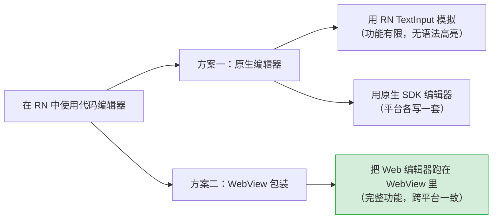

我们选择了 **方案二**——把 CodeMirror 6 完整跑在 WebView 里。这也是 Joplin（44k+ star 的开源笔记应用）的做法。好处显而易见：

1. **功能完整**：CodeMirror 6 的全部能力（语法高亮、Vim 模式、多光标……）原封不动
2. **跨平台一致**：Android / iOS / Web 三端共用同一份编辑器代码
3. **与桌面端共享**：SwarmNote 桌面端（Tauri）也是 Web 环境，编辑器核心代码可以 100% 复用

但代价是——你需要一个**跨 WebView 边界的通信方案**。这正是 Comlink 大显身手的地方。

---

## Comlink 是什么？

[Comlink](https://github.com/nicolo-ribaudo/comlink) 是 Google Chrome 团队开发的一个轻量库（约 3KB），它的核心理念只有一句话：

> **让你像调用本地函数一样调用另一个线程/进程/iframe/WebView 里的函数。**

### 没有 Comlink 的世界

假设 WebView 里有个 `getText()` 方法，你想从 RN 调它。传统做法：

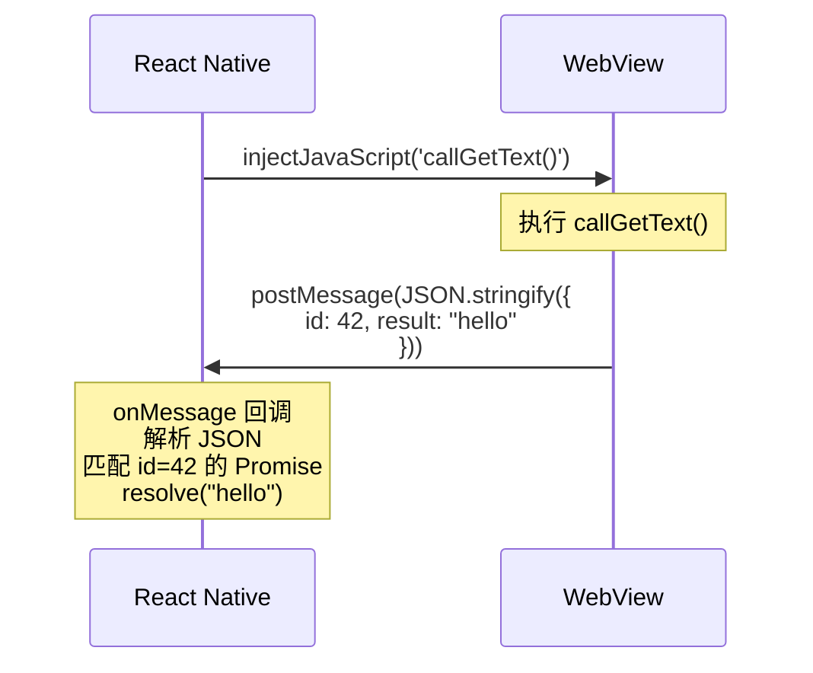

你需要自己管理：
- 消息序列化/反序列化
- 请求 ID 生成与匹配
- Promise 的创建和 resolve/reject
- 错误传播
- 类型安全（纯字符串通信没有类型）

### 有了 Comlink 的世界

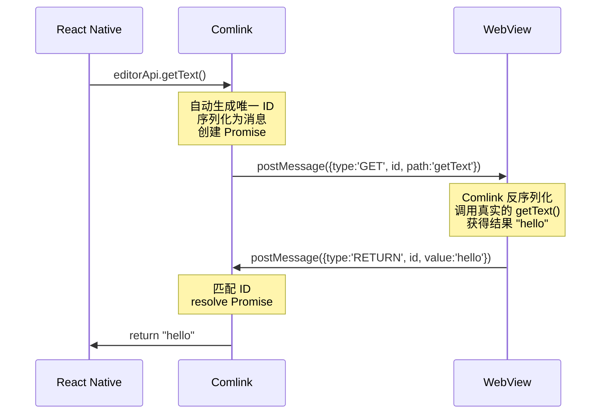

从 RN 的角度看，代码就像在调一个本地异步函数：

```typescript
// 就是这么简单——await 一下就拿到结果了
const text = await editorApi.getText();
```

### Comlink 的三个核心概念

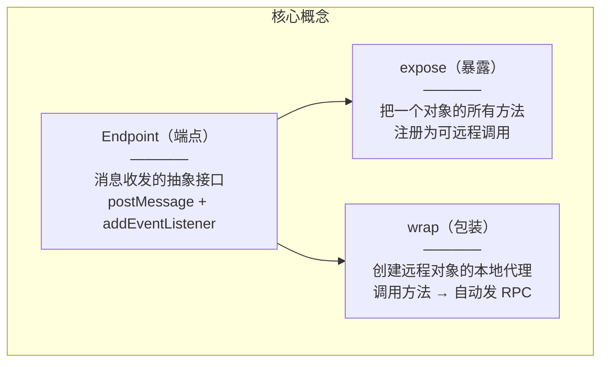

| 概念 | 作用 | 类比 |
|------|------|------|
| `Endpoint` | 消息通道的抽象接口 | 就像一根"网线"，只要能收发消息就行 |
| `Comlink.expose(obj, endpoint)` | 把对象暴露为远程服务 | 就像启动一个"服务端" |
| `Comlink.wrap<T>(endpoint)` | 创建远程代理 | 就像拿到一个"客户端 SDK" |

**关键洞察**：Comlink 不关心消息通过什么介质传输，只要你给它一个符合 `Endpoint` 接口的对象就行。默认支持 Web Worker、iframe，但通过自定义 Endpoint，它可以工作在**任何能收发消息的场景**——包括 React Native WebView。

---

## 整体架构

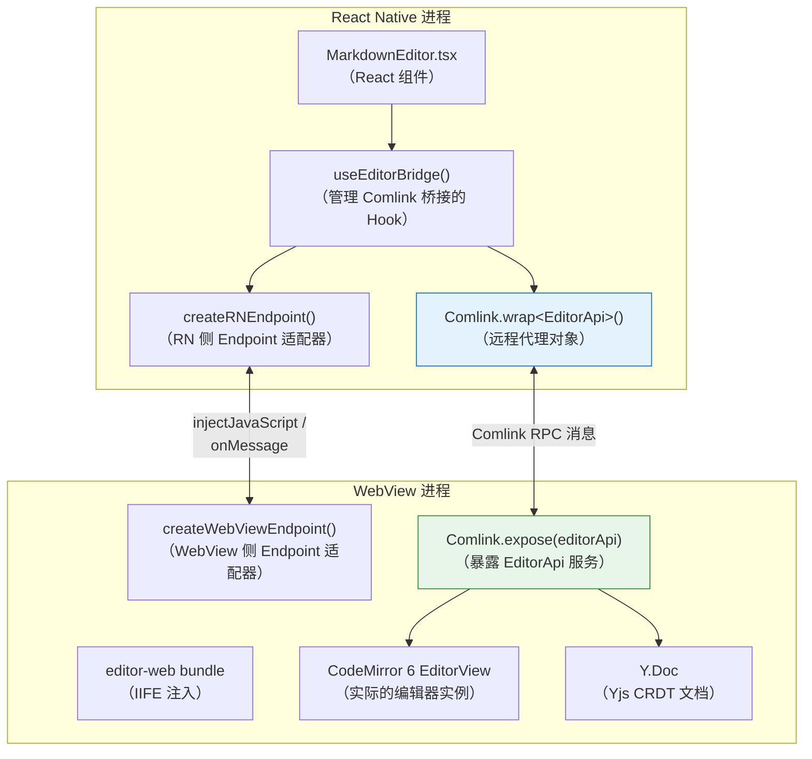

整个架构分为 4 层：

| 层 | 职责 | 关键文件 |
|----|------|----------|
| **UI 层** | React 组件，渲染 WebView | `MarkdownEditor.tsx` |
| **桥接层** | Comlink RPC + 自定义 Endpoint | `useEditorBridge.ts` + `comlink-webview-adapter.ts` |
| **Bundle 层** | 编辑器代码打包 + 注入 | `editor-web/` 包（tsdown + codegen） |
| **编辑器层** | CM6 核心 + Yjs 协作 | `editor/` 包（平台无关） |

---

## 深入 Comlink 原理

### Endpoint 接口

Comlink 的核心抽象是 `Endpoint` 接口，只需要三个方法：

```typescript
interface Endpoint {
  postMessage(message: any, transfer?: Transferable[]): void;
  addEventListener(type: string, listener: EventListenerOrEventListenerObject): void;
  removeEventListener(type: string, listener: EventListenerOrEventListenerObject): void;
}
```

这个接口恰好和 `Worker`、`MessagePort`、`Window` 的消息 API 一致，所以 Comlink 天然支持它们。

### expose 与 wrap 的协作机制

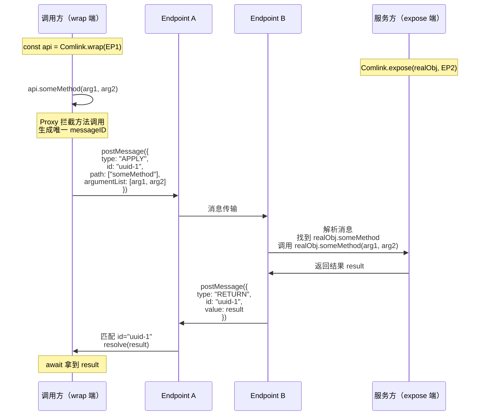

核心流程：

1. `Comlink.wrap()` 返回一个 **ES6 Proxy** 对象
2. 对这个 Proxy 的任何方法调用都会被 `get` trap 拦截
3. 拦截后构造一条 RPC 消息（包含方法名、参数、唯一 ID）
4. 通过 Endpoint 的 `postMessage` 发送
5. 对面的 `Comlink.expose()` 注册了 `addEventListener` 监听
6. 收到消息后调用真实对象的对应方法
7. 把返回值通过 `postMessage` 回传
8. 发起方根据 ID 匹配到之前创建的 Promise 并 resolve

### Proxy 的魔法

`Comlink.wrap<EditorApi>(endpoint)` 返回的类型是 `Comlink.Remote<EditorApi>`。这个类型会自动把所有方法变成返回 `Promise` 的版本：

```typescript
// 原始接口
interface EditorApi {
  getText(): string;
  setText(text: string): void;
  init(options: EditorInitOptions): void;
}

// Comlink.Remote<EditorApi> 自动变为
interface RemoteEditorApi {
  getText(): Promise<string>;       // 返回值包了一层 Promise
  setText(text: string): Promise<void>;
  init(options: EditorInitOptions): Promise<void>;
}
```

这就是 Comlink 的类型安全——你在 RN 侧定义好 `EditorApi` 接口，`Comlink.wrap<EditorApi>()` 自动生成对应的异步代理类型，IDE 自动补全和类型检查全部正常工作。

---

## 适配 React Native WebView

Comlink 默认支持 Web Worker 和 iframe，但不支持 React Native WebView。我们需要自己写 Endpoint 适配器。

### 两端消息通道的差异

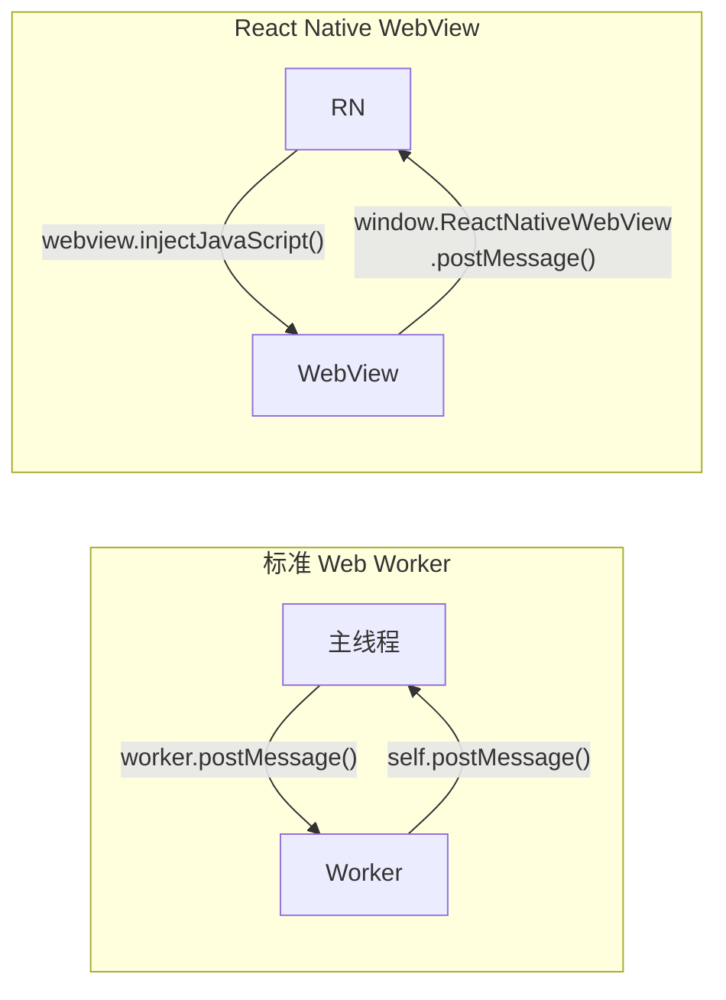

**关键差异**：

| 对比项 | Web Worker | RN WebView |
|--------|-----------|------------|
| RN → WebView | `worker.postMessage(data)` | `webview.injectJavaScript(js)` |
| WebView → RN | `self.postMessage(data)` | `window.ReactNativeWebView.postMessage(string)` |
| 数据格式 | 结构化克隆（支持对象） | **只支持字符串** |
| 接收方式 | `onmessage` 事件 | RN 的 `<WebView onMessage>` prop |

所以适配的核心任务就是：**让这两种不同的通信方式看起来像标准的 Endpoint**。

### RN 侧适配器：createRNEndpoint

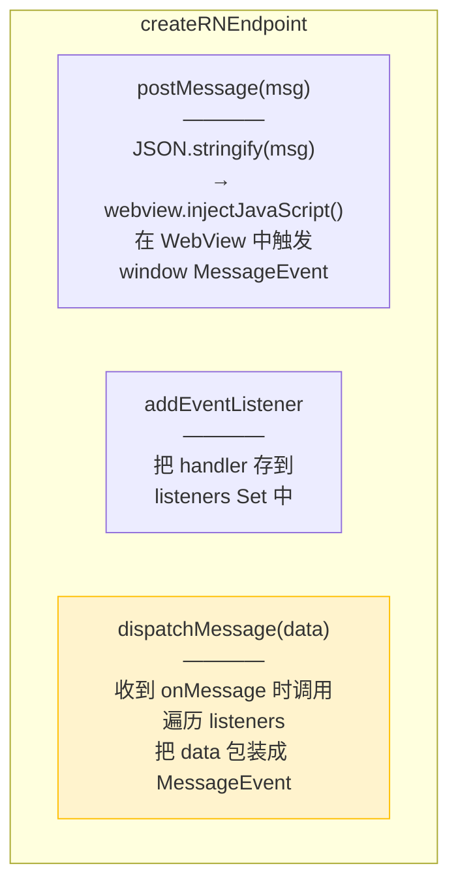

**`postMessage` 的技巧**：RN 没有 `webview.postMessage()`，只能通过 `injectJavaScript()` 在 WebView 中执行一段 JS 来模拟：

```javascript
// 实际注入的 JS 代码
window.dispatchEvent(
  new MessageEvent('message', { data: /* 消息对象 */ })
);
```

这样 WebView 侧的 `window.addEventListener('message', ...)` 就能收到消息——和标准 Endpoint 一样。

**`dispatchMessage` 的作用**：这是一个额外的方法（不属于 Endpoint 接口），当 RN 的 `<WebView onMessage>` 回调触发时，我们手动调用它，把消息分发给 Comlink 注册的 listener。

### WebView 侧适配器：createWebViewEndpoint

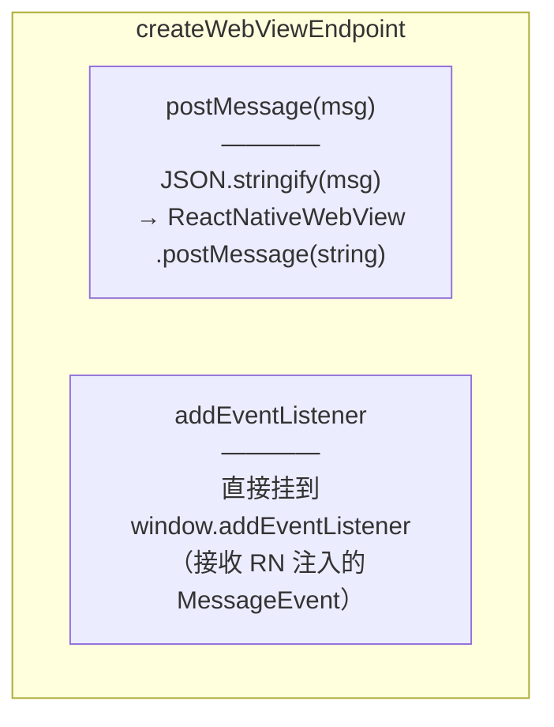

WebView 侧更简单，因为：
- 发送：用 `window.ReactNativeWebView.postMessage()`（RN WebView 注入的全局对象）
- 接收：RN 通过 `injectJavaScript` 触发的 `MessageEvent` 会正常到达 `window.addEventListener`

### 双向通道的完整链路

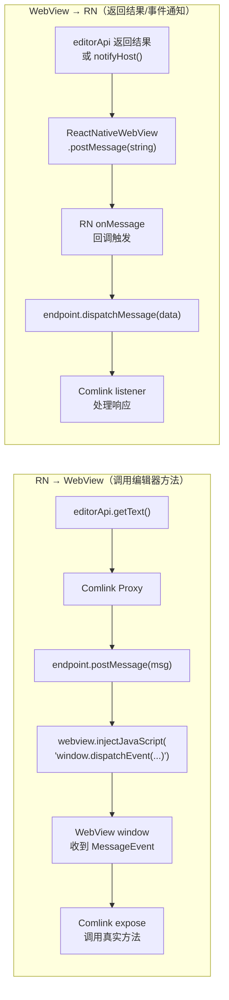

---

## 构建管线：从 TypeScript 到 WebView 注入

WebView 是一个独立的浏览器环境，它不能访问 RN 的 `node_modules`。所以我们需要把编辑器代码和所有依赖打包成一个**自包含的 JS 文件**，然后注入进去。

### 三步构建流水线

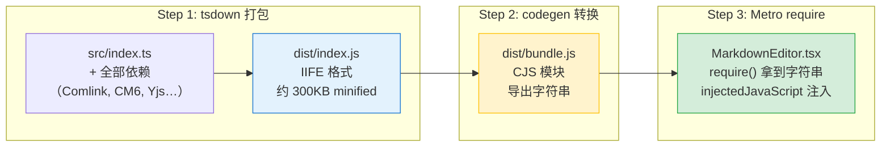

### Step 1：tsdown 打包为 IIFE

**配置**（`tsdown.config.ts`）：

```typescript
export default defineConfig({
  entry: ['src/index.ts'],
  format: ['iife'],           // 立即执行函数格式
  platform: 'browser',        // 浏览器环境
  globalName: 'swarmnoteEditor',
  noExternal: [/.*/],         // 所有依赖全部打进去
  minify: true,
});
```

为什么用 IIFE？因为 WebView 里没有模块系统（没有 `require`、`import`），IIFE 格式的代码可以直接通过 `<script>` 标签或 `eval` 执行。

### Step 2：codegen 包装为字符串

```javascript
// scripts/codegen.mjs
const bundleJs = readFileSync("dist/index.js", "utf-8");
writeFileSync(
  "dist/bundle.js",
  `module.exports = ${JSON.stringify(bundleJs)};\n`
);
```

这一步的巧妙之处：把整个 JS bundle 变成一个**字符串**，包裹在 CJS 模块里。这样 Metro bundler（RN 的打包器）可以 `require()` 它，拿到的不是代码逻辑，而是代码的**文本**。

### Step 3：运行时注入

```typescript
// MarkdownEditor.tsx
const EDITOR_BUNDLE_JS: string = require("@swarmnote/editor-web/dist/bundle");

const injectedJavaScript = `
  try {
    ${EDITOR_BUNDLE_JS}  // ← 整个 bundle 字符串嵌入到这里
  } catch(e) {
    window.ReactNativeWebView.postMessage(JSON.stringify({ error: e.message }));
  }
  true;
`;

<WebView injectedJavaScript={injectedJavaScript} ... />
```

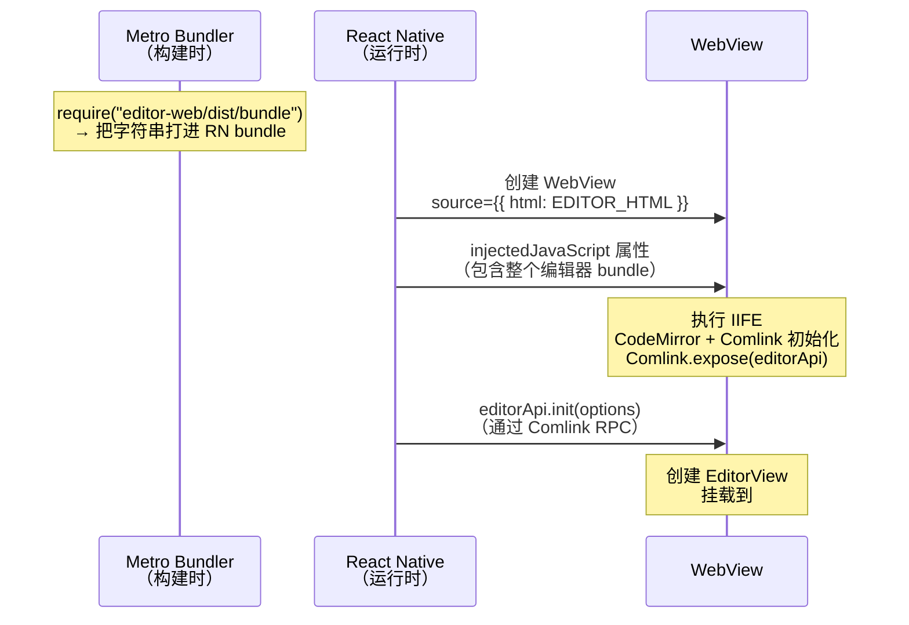

这套流水线的灵感来自 Joplin 项目。Joplin 用完全相同的 IIFE → 字符串 → 注入模式来在 RN WebView 中运行其 CodeMirror 编辑器。

---

## 实战代码走读

### 1. WebView 侧（被调用方）

`packages/editor-web/src/index.ts` 是 WebView 内运行的入口：

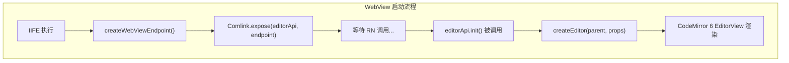

核心代码：

```typescript
// 1. 定义 EditorApi —— WebView 暴露的所有方法
const editorApi: EditorApi = {
  init(options) {
    editor = createEditor(parent, { ... });  // 创建 CM6 实例
  },
  getText() { return editor.getText(); },
  setText(text) { editor.setText(text); },
  execCommand(name, ...args) { editor.execCommand(name, ...args); },
  // ...更多方法
};

// 2. 创建自定义 Endpoint
const endpoint = createWebViewEndpoint();

// 3. 一行代码暴露所有方法
Comlink.expose(editorApi, endpoint);
```

### 2. RN 侧 — useEditorBridge Hook

`src/components/editor/useEditorBridge.ts` 管理整个桥接生命周期：

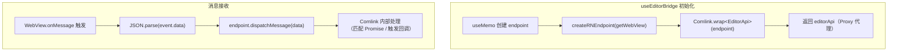

核心代码：

```typescript
export function useEditorBridge(options) {
  const webviewRef = useRef(null);
  const endpointRef = useRef(null);

  // 创建 Comlink 远程代理（只创建一次）
  const editorApi = useMemo(() => {
    const endpoint = createRNEndpoint(() => webviewRef.current);
    endpointRef.current = endpoint;
    return Comlink.wrap<EditorApi>(endpoint);  // 类型安全的代理！
  }, []);

  // WebView 消息处理器（传给 <WebView onMessage>）
  const onWebViewMessage = useCallback((event) => {
    const data = JSON.parse(event.nativeEvent.data);
    endpointRef.current?.dispatchMessage(data);
  }, []);

  return { editorApi, setWebViewRef, onWebViewMessage };
}
```

### 3. MarkdownEditor 组件

`src/components/editor/MarkdownEditor.tsx` 把一切串起来：

```typescript
export function MarkdownEditor({ initialText, enableYjs, ... }) {
  const { editorApi, setWebViewRef, onWebViewMessage } = useEditorBridge({
    onDocChange,
    onYjsUpdate,
  });

  // WebView 加载完成 → 初始化编辑器
  const handleLoadEnd = useCallback(async () => {
    await editorApi.init({ initialText, settings, enableYjs });
    await editorApi.focus();
  }, []);

  return (
    <WebView
      source={{ html: EDITOR_HTML }}
      injectedJavaScript={injectedJavaScript}  // 注入编辑器 bundle
      onMessage={handleMessage}                // 接收 Comlink 消息
      onLoadEnd={handleLoadEnd}                // 加载完成后初始化
    />
  );
}
```

---

## 消息流：一次 RPC 调用的完整旅程

以 `editorApi.getText()` 为例，追踪一条消息从发出到收到返回值的完整流程：

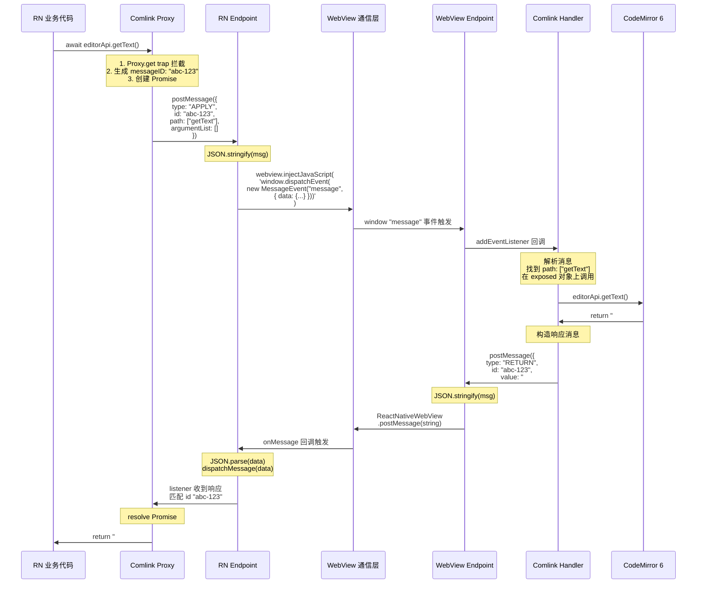

整个过程对调用方来说完全透明——`await editorApi.getText()` 就像调用了一个普通的异步函数。

---

## Yjs 协作层集成

SwarmNote 使用 Yjs（CRDT 库）实现多设备实时协作。Yjs 的 `Y.Doc` 运行在 WebView 内，与 CodeMirror 通过 `y-codemirror.next` 插件绑定。

### 数据流

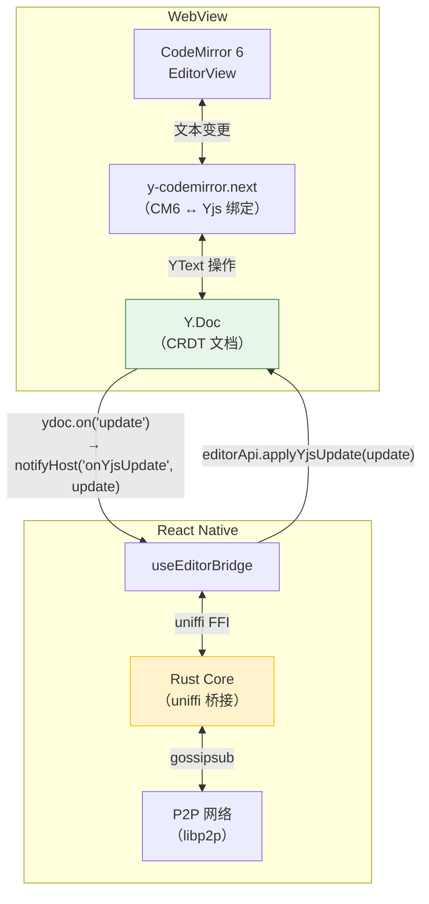

### Yjs Update 的生命周期

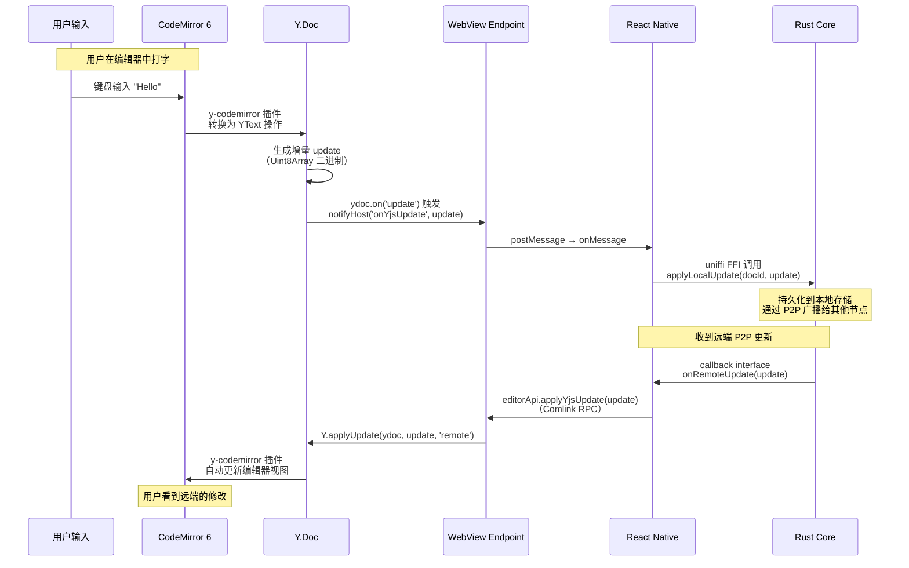

注意 `applyYjsUpdate` 中的 `origin: 'remote'` 参数——这防止了远端更新被再次通过 `ydoc.on('update')` 发回去，避免消息循环。

---

## 踩坑记录

### 1. Android WebView 中文输入崩溃

CodeMirror 6.28+ 引入了 `EditContext` API 支持，但 Android WebView 的 `EditContext` 实现有 bug，会导致中文 IME 组合输入（composition）出错。

**解决方案**：在创建 EditorView 之前全局禁用：

```typescript
(EditorView as unknown as { EDIT_CONTEXT: boolean }).EDIT_CONTEXT = false;
```

### 2. WebView 只能传字符串

React Native WebView 的 `postMessage` 只接受字符串，不支持结构化克隆。所以 Endpoint 适配器里需要手动 `JSON.stringify` / `JSON.parse`。

这也意味着 **`Uint8Array` 不能直接传输**——JSON 序列化会把它变成普通对象。Yjs update 的传输需要额外的序列化处理（如 Base64 编码），这是后续优化的方向。

### 3. injectJavaScript 的异步性

`webview.injectJavaScript()` 是**异步**的——代码不会立即执行。如果在 WebView 还没加载完就调用，消息会丢失。所以我们在 `onLoadEnd` 回调中才开始 Comlink 通信。

### 4. 消息分流

WebView 发回的消息可能是 Comlink 的 RPC 响应，也可能是业务事件（如 `notifyHost('onDocChange')`）。当前通过消息格式区分：

- Comlink 消息：包含 `type: "RETURN"` / `type: "APPLY"` 等字段
- 业务消息：包含 `type: "hostCall"` 字段

所有消息都经过 `dispatchMessage`，Comlink 会忽略不认识的格式。

---

## 总结

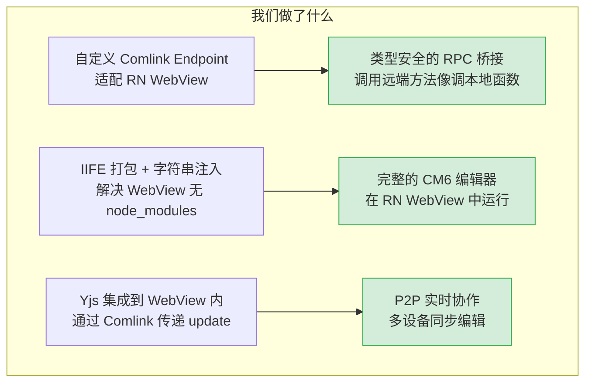

**核心收益**：

1. **类型安全**：定义一次 `EditorApi` 接口，两端共享类型，IDE 自动补全和类型检查全覆盖
2. **代码简洁**：Comlink 把 `postMessage` 的苦力活全部封装，开发者只需关心业务逻辑
3. **架构清晰**：编辑器核心（`@swarmnote/editor`）完全平台无关，桌面端和移动端共享
4. **可扩展**：新增编辑器方法只需在 `EditorApi` 接口加一个方法，两端自动对齐

**参考项目**：

- [Comlink](https://github.com/nicolo-ribaudo/comlink) — Google Chrome 团队开发的 RPC 库
- [Joplin](https://github.com/laurent22/joplin) — 开源笔记应用，同样用 WebView + CodeMirror 6 的方案
- [comlink-webview](https://github.com/nicolo-ribaudo/comlink-webview) — Comlink 的 WebView 适配思路参考
