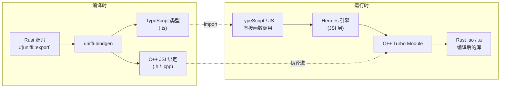
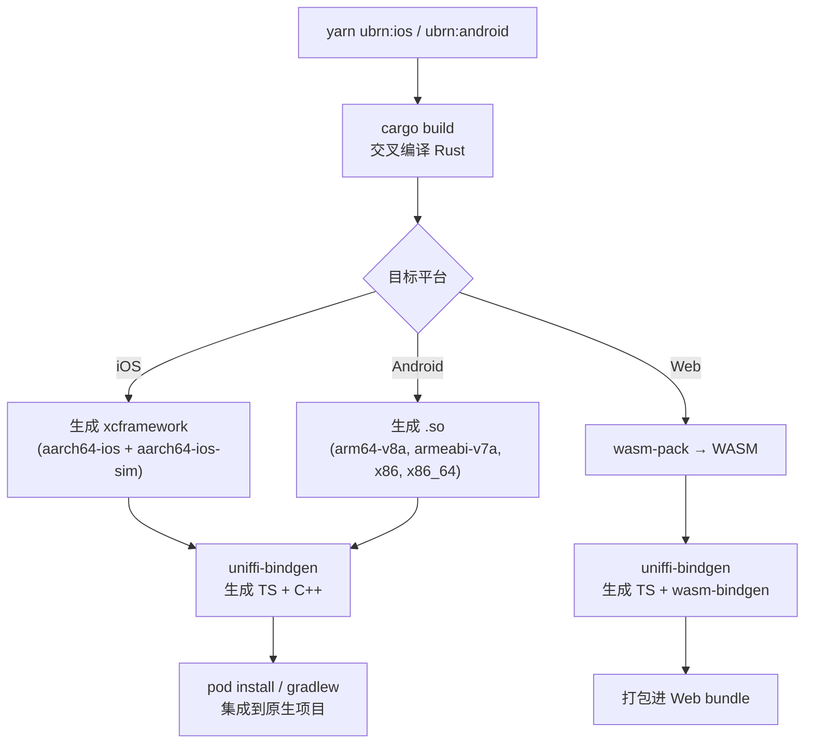
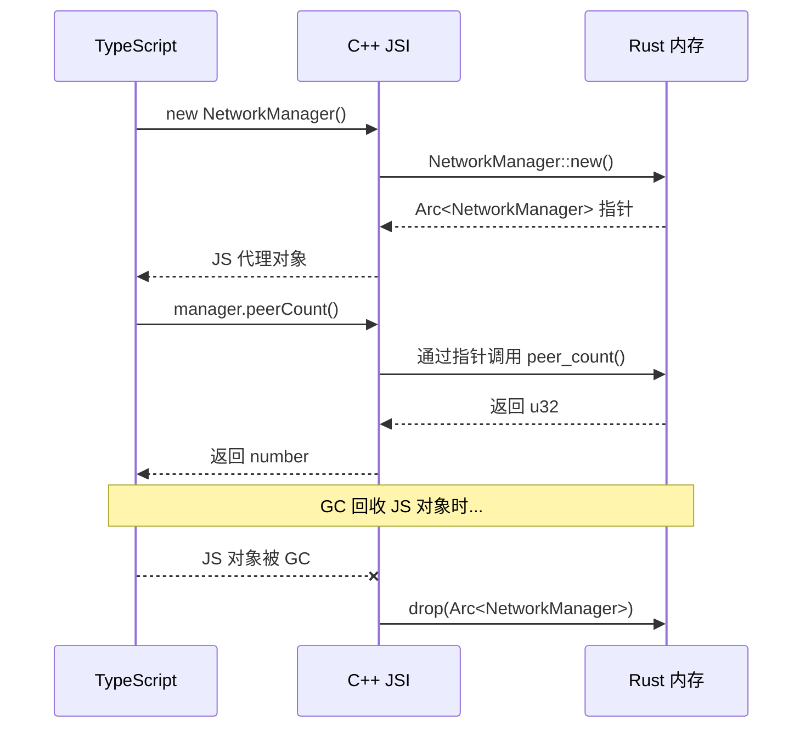
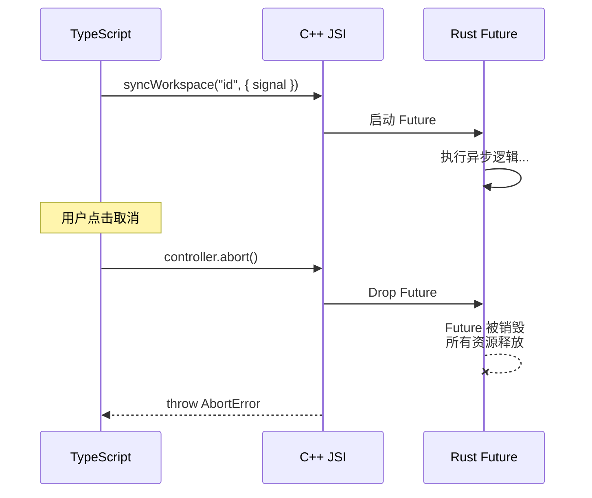
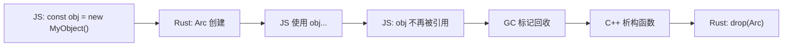
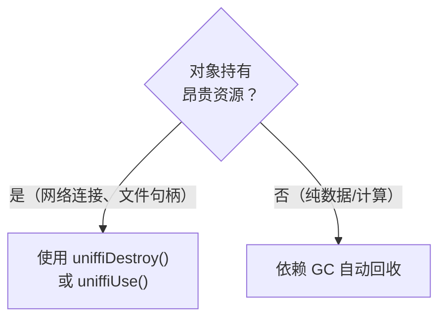
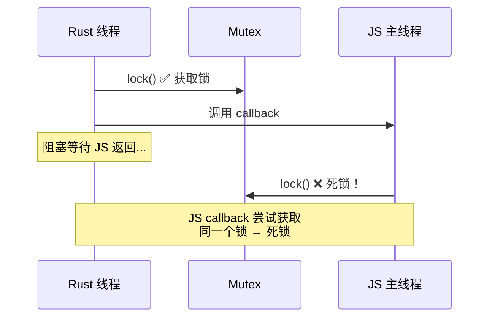
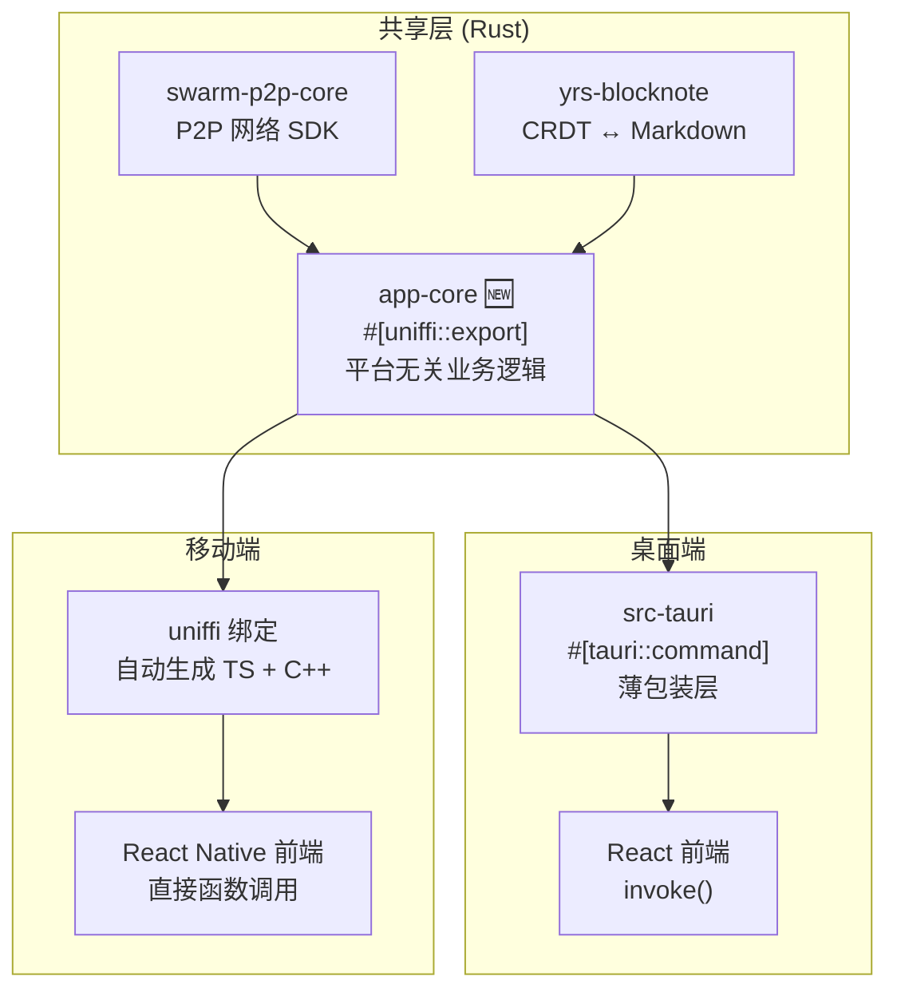

# uniffi-bindgen-react-native 完全指南：用 Rust 驱动 React Native

> 本文系统讲解如何使用 uniffi-bindgen-react-native 将 Rust 代码无缝桥接到 React Native（及 WASM），涵盖环境搭建、项目创建、类型映射、异步模型、事件回调、线程安全、发布流程等全部细节。

## 目录

1. [它是什么？为什么选它？](#1-它是什么为什么选它)
2. [架构原理](#2-架构原理)
3. [环境准备](#3-环境准备)
4. [从零创建项目](#4-从零创建项目)
5. [配置详解：ubrn.config.yaml](#5-配置详解ubrnconfigubrnyaml)
6. [CLI 命令速查](#6-cli-命令速查)
7. [类型映射：Rust ↔ TypeScript](#7-类型映射rust--typescript)
8. [异步与 Promise](#8-异步与-promise)
9. [回调接口：Rust 调用 JS](#9-回调接口rust-调用-js)
10. [错误处理](#10-错误处理)
11. [内存管理与 GC](#11-内存管理与-gc)
12. [线程模型](#12-线程模型)
13. [多 Crate 与工作区](#13-多-crate-与工作区)
14. [发布与分发](#14-发布与分发)
15. [实战：SwarmNote 移动端桥接设计](#15-实战swarmnote-移动端桥接设计)

---

## 1. 它是什么？为什么选它？

**uniffi-bindgen-react-native** 是 Mozilla UniFFI 生态的 React Native 绑定生成器。一句话总结：

> 在 Rust 代码上加 `#[uniffi::export]` 注解 → 自动生成 TypeScript 类型 + C++ JSI 绑定 → 变成一个标准的 React Native Turbo Module。

它由 Mozilla 和 Filament 团队共同维护，Firefox 移动端已大规模使用。

### 与其他方案对比

| | uniffi-bindgen-rn | Expo Modules + C FFI | Ferric (Node-API) |
|---|---|---|---|
| **原理** | UniFFI proc-macro → JSI C++ | 手写 Swift/Kotlin FFI 包装 | napi-rs → Hermes Node-API |
| **类型安全** | ✅ 编译时生成 TS 类型 | ❌ 手动维护 | ✅ 生成 TS 类型 |
| **异步** | ✅ async fn → Promise + AbortSignal | ⚠️ 手动回调 | ✅ async fn → Promise |
| **回调** | ✅ callback_interface trait | ⚠️ 手动事件桥接 | ⚠️ 有限支持 |
| **代码量** | 零胶水代码 | 大量手写桥接 | 少量配置 |
| **成熟度** | 生产就绪（Mozilla） | 稳定但繁琐 | 早期（依赖自定义 Hermes） |
| **平台** | iOS + Android + WASM | iOS + Android | iOS + Android |

### 与 Tauri 的 DX 对比

如果你已经熟悉 Tauri，理解 uniffi 会非常自然：

| 维度 | Tauri | uniffi-bindgen-rn |
|---|---|---|
| **定义方式** | `#[tauri::command]` | `#[uniffi::export]` |
| **调用方式** | `invoke('cmd_name', { args })` | 直接函数调用 `cmdName(args)` |
| **序列化** | JSON (serde) | 无（JSI 直通） |
| **类型安全** | 运行时（serde 反序列化） | 编译时（生成 TS 声明） |
| **IPC 开销** | 较高（WebView fetch） | 低（JSI 直调 C++） |
| **事件推送** | `app.emit("event", payload)` | `callback_interface` trait |

**性能和类型安全上，uniffi 甚至优于 Tauri**——没有 WebView 层，没有 JSON 序列化。

---

## 2. 架构原理

### 2.1 整体链路



关键点：
- **编译时**：uniffi-bindgen 读取 Rust 代码中的 `#[uniffi::export]` 宏，生成对应的 TypeScript 声明和 C++ JSI 绑定代码
- **运行时**：JS 调用 → Hermes JSI → C++ → Rust，全程**无 JSON 序列化**，参数通过 JSI 直接传递

### 2.2 构建流程



### 2.3 生成的文件结构

```
my-rust-lib/
├── ubrn.config.yaml          # 配置文件
├── rust_modules/              # Rust 源码（checkout 或 submodule）
├── cpp/generated/             # 生成的 C++ JSI 绑定
│   ├── MyModule.h
│   └── MyModule.cpp
├── src/generated/             # 生成的 TypeScript 声明
│   ├── MyModule.ts            # 公开 API（你 import 的文件）
│   └── MyModule-ffi.ts        # FFI 底层调用（不直接使用）
├── android/
│   ├── src/main/jniLibs/      # 编译后的 .so 文件
│   │   ├── arm64-v8a/
│   │   ├── armeabi-v7a/
│   │   ├── x86/
│   │   └── x86_64/
│   └── CMakeLists.txt         # 生成的 CMake 配置
├── ios/
│   └── build/MyFramework.xcframework  # iOS 通用框架
└── example/                   # 示例 App
```

每个 namespace 生成两对文件：
- **TypeScript**：`Namespace.ts`（公开 API）+ `Namespace-ffi.ts`（FFI 内部实现）
- **C++**：`Namespace.h` + `Namespace.cpp`

---

## 3. 环境准备

### 3.1 基础工具

```bash
# Rust 工具链
curl --proto '=https' --tlsv1.2 -sSf https://sh.rustup.rs | sh

# C++ 编译工具（macOS）
brew install cmake ninja
brew install clang-format  # 可选，格式化生成的 C++

# C++ 编译工具（Linux）
sudo apt-get install cmake ninja-build clang-format
```

### 3.2 Android 环境

```bash
# 添加 Android 交叉编译目标（4 个架构）
rustup target add \
    aarch64-linux-android \
    armv7-linux-androideabi \
    i686-linux-android \
    x86_64-linux-android

# 安装 cargo-ndk —— 处理 Android NDK 环境配置
cargo install cargo-ndk
```

> **cargo-ndk 是什么？** 它是一个 Cargo 插件，自动设置 Android NDK 的编译器路径、sysroot、链接器等环境变量。没有它你需要手动配置十几个环境变量。

### 3.3 iOS 环境

```bash
# 确保 Xcode 命令行工具已安装
xcode-select --install

# 添加 iOS 交叉编译目标
rustup target add \
    aarch64-apple-ios \           # 真机
    aarch64-apple-ios-sim \       # Apple Silicon 模拟器
    x86_64-apple-ios              # Intel 模拟器
```

### 3.4 其他依赖

- **Node.js** 18+
- **yarn** 包管理器（uniffi-bindgen-rn 目前与 yarn 集成最好）
- **Android Studio**（Android 开发必需）
- **Xcode**（iOS 开发必需，仅 macOS）
- 一个可用的 React Native 开发环境（参考 [React Native 官方环境搭建](https://reactnative.dev/docs/set-up-your-environment)）

---

## 4. 从零创建项目

### Step 1：用 builder-bob 生成脚手架

```bash
npx create-react-native-library@latest my-rust-lib
```

交互式选项：

```
✔ Library type: Turbo module
✔ Languages:    C++ for Android & iOS    ← 必须选 C++
✔ Example app:  Vanilla
```

```bash
cd my-rust-lib
yarn                                # 安装依赖
(cd example/ios && pod install)     # iOS pod 安装
yarn example start                  # 启动 Metro
# 按 i 跑 iOS / 按 a 跑 Android
```

> **为什么用 builder-bob？** 它是 React Native 社区标准的库开发脚手架，生成的项目结构符合 Turbo Module 规范。uniffi-bindgen-rn 在此基础上替换 C++ 实现为 Rust 生成的绑定。

### Step 2：添加 uniffi-bindgen-react-native

```bash
yarn add uniffi-bindgen-react-native
```

在 `package.json` 中添加构建脚本：

```json
{
  "scripts": {
    "ubrn:ios": "ubrn build ios --and-generate && (cd example/ios && pod install)",
    "ubrn:android": "ubrn build android --and-generate",
    "ubrn:web": "ubrn build web",
    "ubrn:checkout": "ubrn checkout",
    "ubrn:clean": "rm -rfv cpp/ android/CMakeLists.txt android/src/main/java android/*.cpp ios/ src/Native* src/index.*ts* src/generated/"
  }
}
```

清理 builder-bob 原来生成的 C++ 模板代码：

```bash
yarn ubrn:clean
```

### Step 3：创建配置文件

在项目根目录创建 `ubrn.config.yaml`：

```yaml
---
# 方式 A：从远程仓库拉取 Rust 代码
rust:
  repo: https://github.com/user/my-rust-crate.git
  branch: main
  manifestPath: crates/my-api/Cargo.toml

# 方式 B：使用本地目录（适合 monorepo 或 submodule）
# rust:
#   directory: ./rust
#   manifestPath: Cargo.toml
```

### Step 4：拉取 Rust 代码

```bash
yarn ubrn:checkout
```

这会将仓库 clone 到 `rust_modules/` 目录。记得在 `.gitignore` 中添加：

```
rust_modules/
*.a
```

### Step 5：构建

```bash
# 构建 iOS（编译 Rust + 生成绑定 + pod install）
yarn ubrn:ios

# 构建 Android（编译 Rust + 生成绑定）
yarn ubrn:android

# 构建 Web（编译 WASM + 生成绑定）
yarn ubrn:web
```

可以指定特定架构以加快开发时编译速度：

```bash
# 只编译 arm64（真机）
yarn ubrn:android --targets aarch64-linux-android

# 只编译模拟器
yarn ubrn:ios --sim-only
```

### Step 6：在 App 中使用

```typescript
// example/src/App.tsx
import { Calculator, SafeAddition, type ComputationResult } from 'my-rust-lib';

const calculator = new Calculator();
const addOp = new SafeAddition();

const result: ComputationResult = calculator
  .calculate(addOp, 3n, 3n)
  .calculateMore(new SafeMultiply(), 7n)
  .lastResult()!;

console.log(result.value.toString()); // "42"
```

注意：**所有 API 都是直接函数调用**，不需要 `invoke()` 或字符串命名。TypeScript 类型完全自动生成。

### Step 7：修改 Rust 代码并重新构建

编辑 `rust_modules/` 下的 Rust 源码，比如添加新函数：

```rust
#[uniffi::export]
pub fn greet(who: String) -> String {
    format!("Hello, {who}!")
}
```

重新构建：

```bash
yarn ubrn:ios   # 或 yarn ubrn:android
```

TypeScript 中直接使用：

```typescript
import { greet } from 'my-rust-lib';
const message = greet("World"); // "Hello, World!"
```

---

## 5. 配置详解：ubrn.config.yaml

完整配置结构：

```yaml
---
# ===== Rust 源码位置 =====
rust:
  # 远程仓库（二选一）
  repo: https://github.com/user/my-rust-sdk
  branch: main
  # 本地目录（二选一）
  # directory: ./rust
  # Cargo.toml 路径（相对于仓库/目录根）
  manifestPath: crates/my-api/Cargo.toml

# ===== 绑定输出位置 =====
bindings:
  cpp: cpp/generated        # C++ 文件输出目录
  ts: src/generated         # TypeScript 文件输出目录
  uniffiToml: ./uniffi.toml # uniffi 配置（可选）

# ===== Android 构建配置 =====
android:
  directory: ./android
  targets:                  # 目标架构
    - arm64-v8a             # = aarch64-linux-android
    - armeabi-v7a           # = armv7-linux-androideabi
    - x86                   # = i686-linux-android（模拟器）
    - x86_64                # = x86_64-linux-android（模拟器）
  apiLevel: 21              # 最低 API 级别
  jniLibs: src/main/jniLibs # .so 文件存放位置
  cargoExtras: []           # 额外的 cargo 参数
  useSharedLibrary: true    # 使用动态库（.so）

# ===== iOS 构建配置 =====
ios:
  directory: ios
  targets:
    - aarch64-apple-ios      # 真机
    - aarch64-apple-ios-sim  # Apple Silicon 模拟器
  frameworkName: build/MyFramework  # xcframework 名称
  cargoExtras: []
  xcodebuildExtras: []

# ===== Web/WASM 构建配置 =====
web:
  manifestPath: rust_modules/wasm/Cargo.toml
  features: []
  defaultFeatures: true
  wasmBindgenExtras: []

# ===== 保护文件不被覆盖 =====
noOverwrite:
  - "*.podspec"
  - CMakeLists.txt
```

> **关键提示**：`manifestPath` 指向的 Cargo.toml 中，`[lib]` 必须声明 `crate-type = ["staticlib"]`（iOS）或 `["cdylib"]`（Android）。

---

## 6. CLI 命令速查

`ubrn` 是 `uniffi-bindgen-react-native` 的命令行别名。

### 核心命令

| 命令 | 说明 |
|------|------|
| `ubrn checkout [REPO]` | 克隆 Rust 仓库到 `rust_modules/` |
| `ubrn build ios` | 编译 Rust → xcframework |
| `ubrn build android` | 编译 Rust → .so (通过 cargo-ndk) |
| `ubrn build web` | 编译 Rust → WASM (通过 wasm-pack) |
| `ubrn generate jsi bindings` | 仅生成 TS + C++ 绑定（不编译） |
| `ubrn generate jsi turbo-module` | 生成 Turbo Module 集成代码 |

### 常用参数

| 参数 | 说明 |
|------|------|
| `--and-generate` | 编译后自动生成绑定（最常用） |
| `--release` | Release 模式编译 |
| `--targets` | 指定目标架构（逗号分隔） |
| `--sim-only` | 仅编译模拟器目标（iOS） |
| `--no-sim` | 仅编译真机目标（iOS） |
| `--config <FILE>` | 指定配置文件路径 |
| `--profile <NAME>` | 使用自定义 Cargo profile |

### 典型用法

```bash
# 开发：只编译模拟器，加快速度
ubrn build ios --sim-only --and-generate

# CI/发布：全架构 Release 编译
ubrn build ios --release --and-generate
ubrn build android --release --and-generate

# 只重新生成绑定（Rust 未改，只改了 uniffi 配置）
ubrn generate jsi bindings --config ubrn.config.yaml
```

---

## 7. 类型映射：Rust ↔ TypeScript

这是使用 uniffi 最核心的知识。理解这些映射，就能在 Rust 端自由定义 API。

### 7.1 标量类型

| Rust | TypeScript | 备注 |
|------|-----------|------|
| `u8`, `u16`, `u32` | `number` | |
| `i8`, `i16`, `i32` | `number` | |
| `f32`, `f64` | `number` | |
| `u64`, `i64` | `bigint` | 64 位整数用 BigInt |
| `bool` | `boolean` | |
| `String` | `string` | UTF-8 |

### 7.2 容器类型

| Rust | TypeScript | 备注 |
|------|-----------|------|
| `Vec<u8>` | `ArrayBuffer` | 字节数组，高效传输二进制数据 |
| `Vec<T>` | `Array<T>` | 最大长度 2³¹ - 1 |
| `HashMap<K, V>` | `Map<K, V>` | |
| `Option<T>` | `T \| undefined` | |
| `SystemTime` | `Date` | |
| `Duration` | `number` | 毫秒 |

### 7.3 Records（值类型，无方法）

Records 是**按值传递**的数据结构，类似 TypeScript 的 plain object。

```rust
#[derive(uniffi::Record)]
struct DocMeta {
    doc_id: String,
    title: String,
    #[uniffi(default = 0)]
    lamport_clock: u64,
}
```

生成的 TypeScript：

```typescript
// 类型定义
type DocMeta = {
    docId: string;        // 自动转 camelCase
    title: string;
    lamportClock: bigint;
};

// 工厂函数（处理默认值）
const DocMeta = {
    create(fields: { docId: string; title: string; lamportClock?: bigint }): DocMeta,
    defaults(): Partial<DocMeta>,
};

// 使用
const meta = DocMeta.create({
    docId: "abc-123",
    title: "My Note",
    // lamportClock 使用默认值 0
});
```

> **命名转换**：Rust 的 `snake_case` 自动转为 TypeScript 的 `camelCase`。

### 7.4 Objects（引用类型，有方法）

Objects 是**按引用传递**的，Rust 端持有实际数据，JS 端持有一个指针。

```rust
#[derive(uniffi::Object)]
struct NetworkManager {
    peers: Vec<String>,
}

#[uniffi::export]
impl NetworkManager {
    // 主构造函数
    #[uniffi::constructor]
    fn new() -> Self {
        Self { peers: vec![] }
    }

    // 命名构造函数
    #[uniffi::constructor(name = "with_bootstrap")]
    fn with_bootstrap(nodes: Vec<String>) -> Self {
        Self { peers: nodes }
    }

    // 实例方法
    fn peer_count(&self) -> u32 {
        self.peers.len() as u32
    }

    fn add_peer(&self, peer_id: String) {
        // ...
    }
}
```

生成的 TypeScript：

```typescript
interface NetworkManagerInterface {
    peerCount(): number;
    addPeer(peerId: string): void;
}

class NetworkManager implements NetworkManagerInterface {
    constructor();
    static withBootstrap(nodes: string[]): NetworkManager;
    peerCount(): number;
    addPeer(peerId: string): void;
    uniffiDestroy(): void;  // 手动释放
}
```



**Trait 支持**：如果 Rust 对象实现了标准 trait，会自动映射：
- `Display` → `toString()`
- `Debug` → `toDebugString()`
- `Eq` → `equals()`
- `Hash` → `hashCode()`

### 7.5 Enums（枚举）

#### 简单枚举（无数据）

```rust
#[derive(uniffi::Enum)]
enum SyncStatus {
    Idle,
    Syncing,
    Synced,
    Error,
}
```

```typescript
enum SyncStatus {
    Idle,
    Syncing,
    Synced,
    Error,
}
// 使用
const status = SyncStatus.Syncing;
```

#### 带数据的枚举（Tagged Union）

这是 Rust 最强大的特性之一——algebraic data types：

```rust
#[derive(uniffi::Enum)]
enum SyncEvent {
    Connected,                                       // 无数据
    Progress(u32, u32),                              // 位置参数
    DocumentUpdated { doc_id: String, title: String }, // 命名参数
    Error { message: String },
}
```

生成的 TypeScript 使用 tagged union 模式：

```typescript
// 标签枚举
enum SyncEvent_Tags {
    Connected,
    Progress,
    DocumentUpdated,
    Error,
}

// 联合类型
type SyncEvent =
    | { tag: SyncEvent_Tags.Connected }
    | { tag: SyncEvent_Tags.Progress; inner: [number, number] }
    | { tag: SyncEvent_Tags.DocumentUpdated; inner: { docId: string; title: string } }
    | { tag: SyncEvent_Tags.Error; inner: { message: string } };

// 构造
const event = new SyncEvent.Progress(10, 100);
const event2 = new SyncEvent.DocumentUpdated({ docId: "abc", title: "My Note" });

// 模式匹配
switch (event.tag) {
    case SyncEvent_Tags.Progress: {
        const [completed, total] = event.inner;
        console.log(`${completed}/${total}`);
        break;
    }
    case SyncEvent_Tags.DocumentUpdated: {
        console.log(event.inner.title);
        break;
    }
}

// 类型守卫
if (SyncEvent.Error.instanceOf(event)) {
    console.error(event.inner.message);
}
```

#### 带显式判别值的枚举

```rust
#[derive(uniffi::Enum)]
pub enum Priority {
    Low = 1,
    Medium = 2,
    High = 3,
}
```

```typescript
enum Priority {
    Low = 1,
    Medium = 2,
    High = 3,
}
```

---

## 8. 异步与 Promise

uniffi 的异步支持是它最吸引人的特性之一——Rust 的 `async fn` 直接映射为 JS 的 `Promise`。

### 8.1 基本用法

```rust
#[uniffi::export]
pub async fn sync_workspace(workspace_id: String) -> Vec<DocMeta> {
    // 内部可以使用 tokio、async-std 等异步运行时
    let docs = fetch_remote_docs(&workspace_id).await;
    merge_local_docs(docs).await
}
```

```typescript
// TypeScript 端 —— 就是一个普通的 async 调用
const docs = await syncWorkspace("my-workspace-uuid");
docs.forEach(doc => console.log(doc.title));
```

### 8.2 AbortSignal 取消（杀手级特性）

**每个 async 函数自动支持取消！** 最后一个可选参数是 `{ signal: AbortSignal }`：

```typescript
const controller = new AbortController();

// 设置 10 秒超时
setTimeout(() => controller.abort(), 10_000);

try {
    const result = await syncWorkspace("my-workspace", {
        signal: controller.signal,
    });
    console.log("同步完成", result);
} catch (e) {
    if (e instanceof Error && e.name === "AbortError") {
        console.log("同步被取消");
    }
}
```

取消时发生了什么：



> **这对 SwarmNote 非常重要**：P2P 同步可能耗时很长，用户随时可以取消，Rust 端的 tokio Future 会被安全 drop，释放网络连接等资源。

### 8.3 注意事项

- ✅ 支持 `async fn` 作为顶层函数和对象方法
- ✅ 支持 `Result` 返回值（rejected Promise 带类型化错误）
- ❌ **不支持**把 Promise/Future 作为参数传递
- ❌ **不支持**把 Promise/Future 作为错误类型

---

## 9. 回调接口：Rust 调用 JS

在很多场景下，Rust 需要主动通知 JS 端——比如网络事件、同步进度、设备发现等。uniffi 通过 **callback interface** 实现这个需求。

### 9.1 基本模式

```rust
// Rust 端定义回调接口
#[uniffi::export(callback_interface)]
pub trait SyncEventListener: Send + Sync {
    fn on_peer_connected(&self, peer_id: String, device_name: String);
    fn on_sync_progress(&self, doc_id: String, completed: u32, total: u32);
    fn on_sync_completed(&self);
    fn on_error(&self, message: String);
}

// Rust 端使用回调
#[uniffi::export]
pub async fn start_sync(
    workspace_id: String,
    listener: Box<dyn SyncEventListener>,
) {
    // 发现节点时回调
    listener.on_peer_connected("QmPeer123".into(), "MacBook Pro".into());

    // 同步过程中报告进度
    for i in 0..10 {
        listener.on_sync_progress("doc-1".into(), i, 10);
        tokio::time::sleep(Duration::from_millis(100)).await;
    }

    listener.on_sync_completed();
}
```

```typescript
// TypeScript 端实现接口
class MySyncListener implements SyncEventListener {
    onPeerConnected(peerId: string, deviceName: string): void {
        console.log(`设备上线: ${deviceName} (${peerId})`);
        // 更新 Zustand store...
    }

    onSyncProgress(docId: string, completed: number, total: number): void {
        console.log(`同步中: ${completed}/${total}`);
        // 更新进度条...
    }

    onSyncCompleted(): void {
        console.log("同步完成！");
    }

    onError(message: string): void {
        console.error(`同步错误: ${message}`);
    }
}

// 启动同步，传入监听器
await startSync("workspace-uuid", new MySyncListener());
```

### 9.2 带返回值的回调

回调方法可以返回值给 Rust 端：

```rust
#[uniffi::export(callback_interface)]
pub trait ConflictResolver: Send + Sync {
    fn resolve_conflict(&self, doc_id: String, local_title: String, remote_title: String) -> bool;
    // 返回 true 表示使用本地版本，false 表示使用远程版本
}
```

```typescript
class MyConflictResolver implements ConflictResolver {
    resolveConflict(docId: string, localTitle: string, remoteTitle: string): boolean {
        // 弹窗让用户选择
        return confirm(`文档 "${localTitle}" 与远程版本 "${remoteTitle}" 冲突，保留本地版本？`);
    }
}
```

### 9.3 带错误处理的回调

回调可以向 Rust 端抛出错误：

```rust
#[derive(uniffi::Error)]
enum StorageError {
    DiskFull,
    PermissionDenied,
}

#[uniffi::export(callback_interface)]
pub trait StorageProvider: Send + Sync {
    fn save_data(&self, key: String, data: Vec<u8>) -> Result<(), StorageError>;
}
```

```typescript
class MyStorage implements StorageProvider {
    saveData(key: string, data: ArrayBuffer): void {
        if (availableSpace < data.byteLength) {
            throw new StorageError.DiskFull();
        }
        // 保存数据...
    }
}
```

### 9.4 Foreign Traits（双向 trait）

与普通 callback interface 不同，Foreign Traits 可以在**两个方向**传递——既可以 JS 实现传给 Rust，也可以 Rust 实现传给 JS。使用 `Arc<>` 而非 `Box<>`：

```rust
#[uniffi::export(with_foreign)]
pub trait Logger: Send + Sync {
    fn log(&self, level: LogLevel, message: String);
}

// Rust 端也可以实现这个 trait
#[derive(uniffi::Object)]
struct FileLogger { /* ... */ }

#[uniffi::export]
impl Logger for FileLogger {
    fn log(&self, level: LogLevel, message: String) {
        // 写入文件...
    }
}

// 接收 trait object —— 可能是 JS 实现，也可能是 Rust 实现
#[uniffi::export]
fn set_logger(logger: Arc<dyn Logger>) { /* ... */ }
```

---

## 10. 错误处理

### 10.1 基本模式

Rust 的 `Result<T, E>` 映射为 Promise 的 resolve/reject：

```rust
#[derive(uniffi::Error)]
pub enum DatabaseError {
    NotFound,
    ConnectionFailed,
    CorruptedData { details: String },
}

#[uniffi::export]
fn get_document(doc_id: String) -> Result<DocMeta, DatabaseError> {
    // ...
}
```

```typescript
try {
    const doc = getDocument("abc-123");
} catch (e: any) {
    // 类型判断 —— 注意：由于 Babel 限制，不能用 instanceof
    if (DatabaseError.instanceOf(e)) {
        // 进一步判断具体变体
        if (DatabaseError.NotFound.instanceOf(e)) {
            console.log("文档不存在");
        }
        // 带数据的错误变体
        if (DatabaseError.CorruptedData.instanceOf(e)) {
            switch (e.tag) {
                case DatabaseError_Tags.CorruptedData:
                    console.error(`数据损坏: ${e.inner.details}`);
                    break;
            }
        }
    }
}
```

> **重要**：不能使用 `e instanceof DatabaseError`！由于 Babel 转译限制，必须使用 uniffi 生成的 `instanceOf` 静态方法。

### 10.2 Flat Error（使用 thiserror）

如果只需要错误消息而不需要结构化数据，可以用 `#[uniffi(flat_error)]`：

```rust
#[derive(Debug, thiserror::Error, uniffi::Error)]
#[uniffi(flat_error)]
pub enum AppError {
    #[error("网络不可用")]
    NetworkUnavailable,

    #[error("解析失败：行 {line}, 列 {col}")]
    ParseError { line: usize, col: usize },
}
```

JS 端收到的是普通 Error，`message` 是 `#[error("...")]` 中的文本。属性不会单独暴露。

### 10.3 命名规则

如果 Rust 错误类型名为 `Error`，生成的 TypeScript 会自动改名为 `Exception`，避免与 ECMAScript 内置 `Error` 冲突。

---

## 11. 内存管理与 GC

这是 Rust（编译时内存管理）和 JS（GC 运行时回收）的交界处，需要特别注意。

### 11.1 自动模式（默认）

Objects 在 JS 端被垃圾回收时，会自动触发 Rust 端的 `drop`：



**问题**：GC 时机不可预测——可能立即回收，也可能很久之后。如果 Rust 对象持有文件句柄、网络连接等资源，延迟释放可能导致问题。

### 11.2 手动释放

每个 Object 都有 `uniffiDestroy()` 方法：

```typescript
const manager = new NetworkManager();
try {
    await manager.sync();
} finally {
    manager.uniffiDestroy(); // 立即释放 Rust 资源
}
```

调用 `uniffiDestroy()` 后，再调用任何方法会抛出错误。可以多次调用 `uniffiDestroy()`（幂等）。

### 11.3 uniffiUse 便捷方法

自动管理生命周期，类似 Rust 的 RAII：

```typescript
const result = new NetworkManager().uniffiUse((manager) => {
    manager.addPeer("peer-1");
    return manager.peerCount();
});
// manager 在 uniffiUse 返回后自动销毁
```

### 11.4 实践建议



---

## 12. 线程模型

### 12.1 基本规则

- **JS 是单线程的**，uniffi 尊重这个约束
- Rust 端可以自由使用多线程（tokio spawn 等）
- 从 Rust 后台线程调用 JS callback 时，**Rust 线程会阻塞等待 callback 返回**

### 12.2 死锁风险



**场景**：Rust 持有 Mutex → 调用 JS callback → callback 触发另一个 Rust 函数 → 该函数尝试获取同一个 Mutex → 死锁。

### 12.3 解决方案

```rust
// ❌ 错误：持有锁时调用 callback
fn notify_change(&self, listener: &dyn EventListener) {
    let data = self.state.lock().unwrap();
    listener.on_change(data.clone()); // 死锁风险！
}

// ✅ 正确：释放锁后再调用 callback
fn notify_change(&self, listener: &dyn EventListener) {
    let data = {
        let guard = self.state.lock().unwrap();
        guard.clone()
    }; // 锁在这里释放
    listener.on_change(data); // 安全
}
```

另一种方案——让 callback 异步化，在下一个事件循环 tick 执行：

```rust
// 使用 channel 解耦
fn notify_change(&self) {
    let data = self.state.lock().unwrap().clone();
    self.event_sender.send(Event::Changed(data)).unwrap();
    // callback 在事件循环中异步处理，不阻塞当前线程
}
```

### 12.4 WASM 单线程

WASM 环境是完全单线程的。如果代码需要同时支持 RN 和 WASM，注意：

```rust
// 条件编译：WASM 不需要 Send
#[cfg_attr(not(target_arch = "wasm32"), async_trait::async_trait)]
#[cfg_attr(target_arch = "wasm32", async_trait::async_trait(?Send))]
pub trait MyAsyncTrait {
    async fn do_work(&self) -> String;
}
```

---

## 13. 多 Crate 与工作区

实际项目中，Rust 代码通常分布在多个 crate 中。uniffi 支持这种场景。

### 13.1 Cargo 工作区结构

```
my-project/
├── Cargo.toml              # [workspace]
├── crates/
│   ├── core/               # 核心逻辑
│   │   ├── Cargo.toml
│   │   └── src/lib.rs      # #[uniffi::export]
│   ├── network/             # 网络模块
│   │   ├── Cargo.toml
│   │   └── src/lib.rs      # #[uniffi::export]
│   └── api/                 # 统一入口 crate
│       ├── Cargo.toml       # 依赖 core + network
│       └── src/lib.rs       # re-export
```

### 13.2 配置

`ubrn.config.yaml` 中 `manifestPath` 指向统一入口 crate：

```yaml
rust:
  directory: ./rust_modules/my-project
  manifestPath: crates/api/Cargo.toml
```

入口 crate 的 `lib.rs` 中 re-export 所有需要暴露的类型：

```rust
// crates/api/src/lib.rs
pub use core::*;      // re-export core 模块的所有公开 API
pub use network::*;   // re-export network 模块
```

### 13.3 uniffi.toml 配置

如果多个 crate 定义了 uniffi 类型，需要在 `uniffi.toml` 中声明：

```toml
[bindings.typescript]
# 配置 TypeScript 生成选项
module_name = "my-rust-lib"
```

---

## 14. 发布与分发

### 14.1 预编译二进制发布

推荐方式——npm 包中包含预编译好的 `.so` / `.xcframework`：

```json
// package.json
{
  "files": [
    "android",             // 包含 jniLibs/*.so
    "build",               // 包含 *.xcframework
    "cpp",                 // 生成的 C++ 绑定
    "src",                 // 生成的 TypeScript
    "ios",                 // iOS 项目文件
    "*.podspec"
  ]
}
```

> **注意 .gitignore**：npm 默认参考 `.gitignore` 决定打包内容。`.a` 文件和 `build/` 目录通常被 ignore，需要在 `files` 数组中显式包含。

验证打包内容：

```bash
npm pack --dry-run
```

### 14.2 源码发布

让用户自己编译 Rust（包小，但用户需要 Rust 工具链）：

```json
{
  "scripts": {
    "postinstall": "yarn ubrn:checkout && yarn ubrn:android --release && yarn ubrn:ios --release"
  }
}
```

### 14.3 发布检查清单

- [ ] 全架构 Release 编译通过
- [ ] iOS 真机 + 模拟器都测试
- [ ] Android 4 个架构都有 .so
- [ ] `npm pack --dry-run` 检查包内容
- [ ] TypeScript 类型导出正确
- [ ] README 标注 uniffi-bindgen-react-native

---

## 15. 实战：SwarmNote 移动端桥接设计

把前面学到的知识应用到 SwarmNote 的移动端架构上。

### 15.1 架构目标



### 15.2 app-core API 设计示例

```rust
// crates/app-core/src/lib.rs

// ===== 数据类型 =====

#[derive(uniffi::Record)]
pub struct DocInfo {
    pub doc_id: String,
    pub title: String,
    pub content_preview: String,
    pub updated_at: SystemTime,
}

#[derive(uniffi::Enum)]
pub enum NetworkStatus {
    Offline,
    Connecting,
    Online { peer_count: u32 },
}

// ===== 事件回调 =====

#[uniffi::export(callback_interface)]
pub trait AppEventListener: Send + Sync {
    fn on_network_status_changed(&self, status: NetworkStatus);
    fn on_peer_connected(&self, peer_id: String, device_name: String);
    fn on_sync_progress(&self, completed: u32, total: u32);
    fn on_document_updated(&self, doc_id: String);
    fn on_pairing_request(&self, peer_id: String, device_name: String);
}

// ===== 核心管理器 =====

#[derive(uniffi::Object)]
pub struct SwarmNoteCore { /* ... */ }

#[uniffi::export]
impl SwarmNoteCore {
    #[uniffi::constructor]
    pub async fn new(
        data_dir: String,
        listener: Box<dyn AppEventListener>,
    ) -> Self { /* ... */ }

    // 网络
    pub async fn start_network(&self) -> Result<(), AppError> { /* ... */ }
    pub async fn stop_network(&self) { /* ... */ }

    // 文档
    pub async fn list_documents(&self) -> Vec<DocInfo> { /* ... */ }
    pub async fn get_document(&self, doc_id: String) -> Result<Vec<u8>, AppError> { /* ... */ }
    pub async fn save_document(&self, doc_id: String, content: Vec<u8>) -> Result<(), AppError> { /* ... */ }

    // 配对
    pub async fn generate_pairing_code(&self) -> Result<String, AppError> { /* ... */ }
    pub async fn accept_pairing(&self, peer_id: String) -> Result<(), AppError> { /* ... */ }
}
```

### 15.3 Tauri 命令 → UniFFI 映射对照

| Tauri (现在) | UniFFI (app-core) | 变化 |
|---|---|---|
| `#[tauri::command] async fn start(app: AppHandle, ...)` | `#[uniffi::export] pub async fn start_network(&self)` | 去掉 AppHandle |
| `app.emit("peer-connected", payload)` | `listener.on_peer_connected(peer_id, name)` | 事件 → callback |
| `app.state::<DbState>()` | `self.db: Arc<DatabaseConnection>` | 状态自持有 |
| `invoke("get_documents", {})` | `core.listDocuments()` | 类型安全直调 |

### 15.4 RN 端使用示例

```typescript
// mobile/src/hooks/useSwarmNote.ts
import { SwarmNoteCore, type AppEventListener, type NetworkStatus } from 'swarmnote-rust-lib';

class SwarmNoteListener implements AppEventListener {
    constructor(private store: ReturnType<typeof useNetworkStore.getState>) {}

    onNetworkStatusChanged(status: NetworkStatus): void {
        this.store.setNetworkStatus(status);
    }

    onPeerConnected(peerId: string, deviceName: string): void {
        this.store.addPeer({ peerId, deviceName });
    }

    onSyncProgress(completed: number, total: number): void {
        this.store.setSyncProgress({ completed, total });
    }

    onDocumentUpdated(docId: string): void {
        // 触发文档列表刷新
        queryClient.invalidateQueries(['documents']);
    }

    onPairingRequest(peerId: string, deviceName: string): void {
        // 显示配对确认弹窗
        Alert.alert(`设备 "${deviceName}" 请求配对`, '是否接受？', [
            { text: '拒绝', style: 'cancel' },
            { text: '接受', onPress: () => core.acceptPairing(peerId) },
        ]);
    }
}

// 初始化
const core = await SwarmNoteCore.new(dataDir, new SwarmNoteListener(store));
await core.startNetwork();
```

---

## 附录：常见问题

### Q: uniffi-bindgen-rn 能和 Expo 一起用吗？

可以，但需要使用 **Expo Development Build**（不支持 Expo Go）。通过 `expo prebuild` 生成原生项目后，uniffi 生成的 Turbo Module 可以正常集成。社区已有 [Expo + UniFFI 的成功实践](https://claas.dev/posts/expo-with-rust/)。

### Q: 编译速度慢怎么办？

- 开发时用 `--sim-only`（iOS）或 `--targets aarch64-linux-android`（Android）只编译单架构
- 使用 `--profile dev` 跳过优化
- 只修改 Rust 代码时不需要重跑 `pod install`

### Q: 支持哪些 React Native 版本？

需要 **React Native 0.75+**（Turbo Module 支持）。推荐 0.83+（SDK 55）。

### Q: 项目即将改名？

是的。由于新增了 WASM 支持，"React Native" 已不再准确，计划改名为 **uniffi-bindgen-javascript**。会保持向后兼容。

### Q: 和 Ferric (Node-API) 方案怎么选？

目前选 uniffi-bindgen-rn。Ferric 依赖自定义 Hermes 版本，要等 Node-API PR 合并到 Hermes 主线才能普及。Hermes 团队态度也比较保守。uniffi 已生产验证，是更安全的选择。

---

## 参考资料

- [uniffi-bindgen-react-native 官方文档](https://jhugman.github.io/uniffi-bindgen-react-native/)
- [uniffi-bindgen-react-native GitHub](https://github.com/jhugman/uniffi-bindgen-react-native)
- [Mozilla UniFFI](https://github.com/mozilla/uniffi-rs)
- [Expo + Rust 实践 (claas.dev)](https://claas.dev/posts/expo-with-rust/)
- [expo-rust-demo](https://github.com/dgca/expo-rust-demo)
- [Rusty Native Modules (React Summit 2025)](https://gitnation.com/contents/rusty-native-modules-for-react-native)
