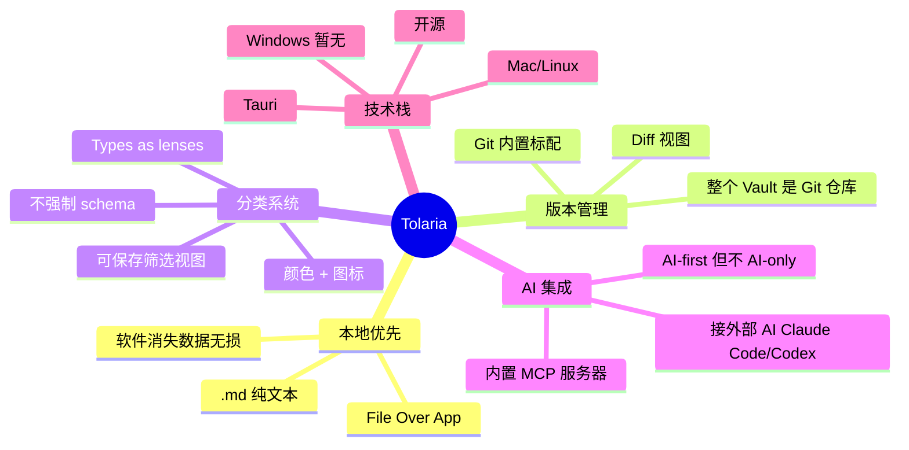
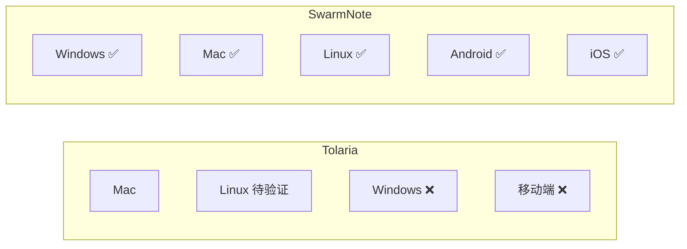
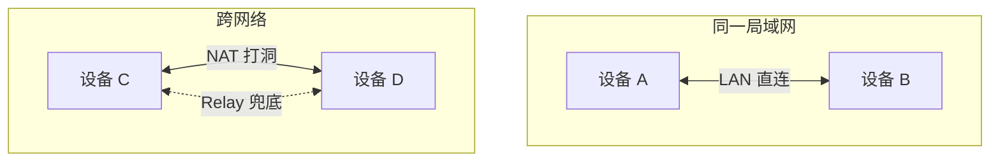
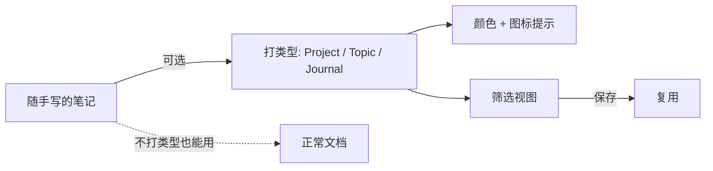
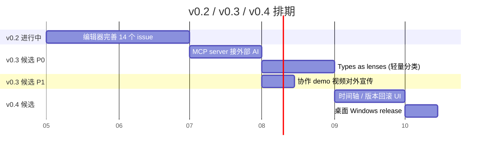

# 竞品分析：Tolaria

**日期**：2026-04-27
**对象**：Tolaria（<https://tolaria.md/>）
**来源文章**：「Tolaria，Obsidian 后发的精神继承者」(WeChat MP)
**目的**：盘点 SwarmNote 相对 Tolaria 的差异化优势 + 值得借鉴的方向，作为 v0.3+ 路线图输入。

## 概览

Tolaria 是 2026 初出现的 PKM 笔记产品，定位"Obsidian 精神继承者 + 开源 + 后发优势 + AI 友好"。Mac/Linux 桌面端，Tauri 技术栈。文章作者评价它"集大成"，但承认仍处早期：bug 不少、还没 Windows 版、没插件生态。

**对 SwarmNote 的意义**：Tolaria 验证了"本地优先 + 开源 + 现代编辑器"这条路是有市场的；同时它**没解决多设备同步和移动端**——而这正是 SwarmNote 的差异化主战场。

## Tolaria 关键特性梳理



四个核心卖点，前两个继承 Obsidian 哲学，后两个是 Tolaria 自己的发明。

## 对比矩阵

| 维度 | Tolaria | SwarmNote | 差异性质 |
|---|---|---|---|
| 本地优先 .md | ✅ | ✅ | 持平 |
| 开源 | ✅ | ✅ MIT | 持平 |
| Markdown / YAML | ✅ | ✅ | 持平 |
| 版本历史 | ✅ Git 内置 | CRDT 历史（隐式） | 思路不同 |
| 双向链接 | ✅ | v0.2 编辑器规划 | 小落后 |
| **移动端** | ❌ 完全没有 | ✅ iOS + Android | ⭐⭐⭐ 大优势 |
| **Windows** | ❌ 还没 | ✅ Tauri 全平台 | ⭐⭐ 优势 |
| **多设备同步** | ❌ 没方案 | ✅ P2P libp2p | ⭐⭐⭐ 大优势 |
| **实时多端协作** | ❌ 单机 | ✅ CRDT 自动合并 | ⭐⭐⭐ 大优势 |
| Types / 视图 | ✅ 设计独到 | ❌ 还没概念 | 小落后 |
| 内置 AI / MCP | ✅ 接外部 AI | ❌ 暂无 | 小落后 |
| 编辑器 | 未明确 | CodeMirror 6 Live Preview | 未对比 |
| 跨平台栈 | Tauri | Tauri (桌面) + Expo (移动) + 共享 Rust 核心 | 架构更复杂但覆盖更广 |
| 成熟度 | 很新，bug 多 | 也很新，开发中 | 持平 |

## SwarmNote 三条核心差异化优势

### 1. 双端 + 跨平台移动一等公民 ⭐⭐⭐

文章原话："这种 Tauri 项目居然还要挑挑拣拣 Windows……"



SwarmNote 一开始就把 **桌面 Tauri + 移动 Expo + 共享 Rust 核心** 当作前提：

- Rust crate `swarmnote-core` 是单一业务源，桌面通过 Tauri command 调用，移动通过 `uniffi-bindgen-react-native` 调用
- 移动端不是"阉割版桌面"，是真正可用的写作环境（CodeMirror 6 在 WebView 内，CRDT 同步直连）

**时间窗口**：Tolaria 还没 Windows 版的同期，SwarmNote 已经在做移动端。这是约 1 年的领先窗口。

### 2. P2P 真去中心化同步 ⭐⭐⭐

Tolaria 继承 Obsidian "File Over App" 哲学，但**没有解决同步**——Obsidian 自己也要 Sync 订阅或第三方云盘。文章里直说"协作也基本不要想了"。

SwarmNote 直接跑 **libp2p**：



- 配对一次后设备直连，无服务器、无订阅
- LAN / Hole-punch / Relay 三层连通策略，覆盖 99% 场景
- 数据完全在用户自己的设备间流转，**真正的本地优先**

**护城河**：Tolaria/Obsidian 这条路要补这个能力，等于重做底层。SwarmNote 这是 day 0 设计。

### 3. CRDT 多端实时合并 ⭐⭐⭐

| 思路 | Git（Tolaria） | CRDT（SwarmNote） |
|---|---|---|
| 并发场景 | 冲突，需要人工 merge | 自动合并，结果一定收敛 |
| 离线编辑 | 拉回来要 rebase | 上线后无感合并 |
| 历史粒度 | commit 级 | 操作级（精细到字符） |
| 协作能力 | 不适合 | 适合 |

CRDT 不只是技术选择，是产品能力差异：用户两台设备同时编辑同一篇笔记，最终结果一致——这是 Tolaria 这种 Git 路线**做不到**的体验。

## Tolaria 值得借鉴 / 留意的地方

### A. AI 集成（MCP）—— 强烈建议学

Tolaria 把 Vault 暴露成 **MCP server**，让 Claude Code / Codex 直接读写笔记：

```
用户: "把过去一周关于『管理学』的散碎笔记整理成长文，更新到主页目录"
       ↓ MCP
AI 客户端 ← 读取 Vault 结构 + 笔记内容
       ↓
AI 客户端 → 创建/修改 .md 文件
```

**对 SwarmNote 的契合度极高**：

- 我们已有 Rust 核心 `swarmnote-core`，加一层 MCP server bin 是自然延伸
- 桌面端跑起来即可暴露给本地 AI 客户端，移动端不需要暴露
- "AI-first 但不 AI-only"完美契合 SwarmNote 的"用户主权"哲学：不绑定自家 AI，不被 AI 涨价绑架

**优先级**：v0.3 候选 P0。

### B. Types as lenses —— 设计哲学值得抄

不强制 schema，但提供"打类型 + 颜色图标 + 筛选视图"的轻量分类系统：



比 Notion 的"先定结构再写"更友好，比 Obsidian 的纯标签更直观。

**实现成本**：不高。SwarmNote 已经支持 frontmatter（`@swarmnote/editor` 已识别 YAML），只需要：
1. 约定一个 frontmatter 字段（如 `type: project`）
2. UI 层渲染颜色/图标
3. 加一个"按 type 筛选"的视图

**优先级**：v0.3 候选 P1。

### C. Git 内置版本历史 —— 有想象空间但路径不同

Tolaria 的 "Diff 视图"用户感知非常直接，作者原话"看到那些 Diff 视图，我估计有人会感动到要哭"。

SwarmNote 的 yjs CRDT 本身就有完整的操作历史，理论上能做出**比 Git 更细粒度**的 timeline——精细到字符级、无 merge conflict、自然支持多人。

**实现路径**：

- 不集成 Git（与 CRDT 哲学冲突）
- 复用 yjs `UndoManager` + 历史操作流，做"时间轴 + 版本快照"可视化
- 桌面端先做，移动端后续跟进

**优先级**：v0.4 候选。

## 短期路线图建议



**关键提醒**：

- **v0.2 不动产品方向**，把编辑器完善打透
- **v0.3 是差异化"夯实期"**：MCP（追平 Tolaria AI 能力）+ Types（追平 Tolaria 分类设计）
- **协作 demo 视频**：CRDT 是最难复制的护城河，应该有一段"两台手机同时改一篇笔记"的演示视频对外宣传，让人一眼明白差异

## 一句话定位（建议）

> **"Obsidian 的本地优先哲学 + Tolaria 的开源后发精神 + libp2p 的真同步 + 移动端的一等公民。"**

Tolaria 解决了"开源后发取代 Obsidian"，但没解决"本地优先怎么多设备"；
SwarmNote 是另一条路：**接受 Obsidian 的哲学，正面解决它的同步死穴，并且不放弃移动端**。

## 风险与未知

- **Tolaria 的成熟速度**：开源项目 + AI Coding 加速，可能比传统估算更快补齐 Windows / 移动端 / 同步。需要持续跟进。
- **SwarmNote 的 AI 故事**：当下还没动 AI 这块。MCP 是低成本切入，但若 v0.3 不做，可能在产品宣传上吃亏。
- **协作场景的可见性**：CRDT 是技术优势但不易被用户感知。要在产品 onboarding / 营销物料中显式呈现。

## 附录：可继续追踪

- Tolaria 官网：<https://tolaria.md/>
- 是否真开源？许可证？文章只说"开源特性"未明示 license，需查 GitHub
- AI 集成除 MCP 外是否有其它形态
- 移动端是否在路线图（决定 SwarmNote 的窗口期长短）
