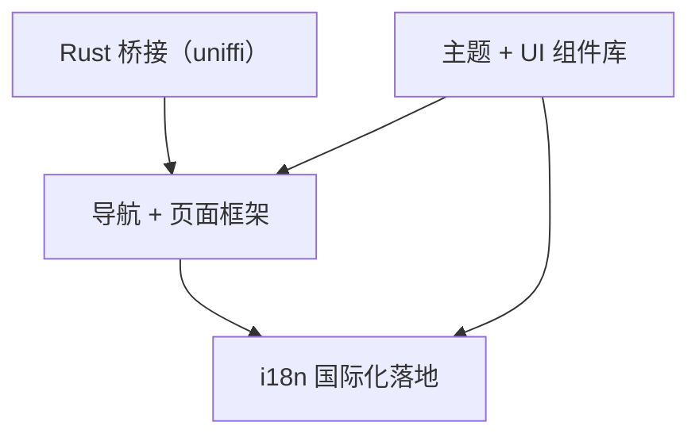

# v0.1.0 - 基础设施搭建

> 搭建移动端核心基础设施：Rust 桥接验证、导航框架、主题系统、国际化落地，为后续业务功能开发打好地基。

## 目标

这个版本完成后：

- uniffi-bindgen-react-native 集成验证通过，能从 React Native 调用 Rust 函数
- App 导航骨架（Drawer + Tab）搭建完成，各主要页面有占位内容
- 移动端独立主题系统就位，亮色/暗色模式切换可用，常用 RNR 组件引入
- Lingui i18n 在实际页面中落地，中英文切换可用

**不涉及任何业务功能**（编辑器、P2P 同步、身份管理、工作区管理等均推迟到后续版本）。

## 范围

### 包含

- Rust 桥接（uniffi） — 验证链路，RN 能调用简单 Rust 函数
- 导航 + 页面框架 — Drawer + Tab 混合导航骨架 + 占位页
- 主题 + UI 组件库 — 移动端独立设计主题色、暗色模式、引入 RNR 组件
- i18n 国际化落地 — Lingui 在实际页面中使用，中英文切换

### 不包含（推迟到后续版本）

- 富文本编辑器（BlockNote / 其他）
- P2P 网络 / 设备配对 / 同步
- 身份管理（PeerId 生成/持久化）
- 工作区管理 / 文档 CRUD
- 文件树

## 功能清单

### 依赖关系

| 层级 | 功能 | 可并行 |
| ---- | ---- | ------ |
| L0（无依赖） | Rust 桥接（uniffi）、主题 + UI 组件库 | 全部可并行 |
| L1（依赖 L0） | 导航 + 页面框架、i18n 国际化落地 | 导航依赖主题；i18n 依赖导航和主题 |

### 功能清单

| 功能 | 优先级 | 依赖 | Feature 文档 | Issue |
| ---- | ------ | ---- | ------------ | ----- |
| Rust 桥接（uniffi） | P0 | - | [link](features/rust-bridge.md) | #1 |
| 主题 + UI 组件库 | P0 | - | [link](features/theme-ui.md) | #2 |
| 导航 + 页面框架 | P0 | 主题 | [link](features/navigation.md) | #9 |
| i18n 国际化落地 | P1 | 导航、主题 | [link](features/i18n.md) | #10 |

## 验收标准

- [ ] 能在 Android 真机/模拟器上运行 Development Build
- [ ] RN 侧调用 Rust 函数并显示返回值（uniffi 链路跑通）
- [ ] Drawer + Tab 导航可正常切换，各占位页可访问
- [ ] 亮色/暗色主题切换正常，主题色贯穿所有页面
- [ ] 中英文切换生效，所有占位页文字均已国际化
- [ ] `pnpm lint` 无错误，TypeScript 编译通过

## 技术选型

> 基础技术栈已在 CLAUDE.md 中确定，此处仅记录 v0.1.0 新增的决策。

| 领域 | 选择 | 备注 |
| ---- | ---- | ---- |
| Rust 桥接 | **uniffi-bindgen-react-native** | 参考 dev-notes/blog/uniffi-bindgen-react-native-guide.md |
| 导航模式 | **Drawer + Tab 混合** | 底部 Tab 主导航 + 侧边 Drawer，具体页面规划需调研主流 App 后确定 |
| 主题设计 | **移动端独立设计** | 不复用桌面端主题色，适配移动端交互习惯 |
| 暗色模式 | **NativeWind class 策略** | 与系统主题联动 |

## 依赖与风险

- **风险**：uniffi-bindgen-react-native 是较新的工具链，文档和社区支持有限，集成过程可能踩坑（编译环境、类型映射、Android NDK 配置等）
- **缓解**：已有详细集成指南（dev-notes/blog/），可参考；仅验证链路，不深入复杂类型映射

## 时间线

- 开始日期：2026-04-09
- 目标发布日期：不设截止日期，按节奏推进
- Milestone：[v0.1.0](https://github.com/yexiyue/SwarmNote-RN/milestone/1)
