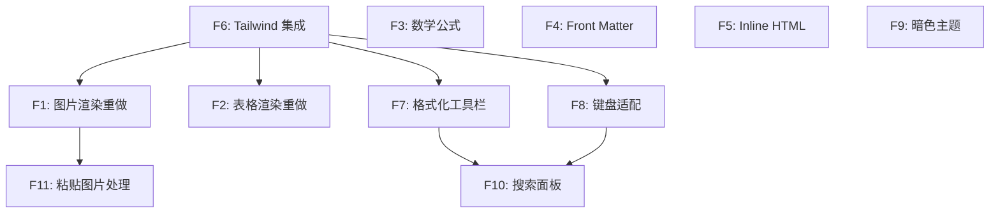

# v0.2.0 - 编辑器体验完善

> 完善 Live Preview 渲染（图片、表格、公式等），引入 Tailwind CSS 统一 Widget 样式，打磨移动端编辑器 UX（工具栏、键盘、暗色模式、搜索、粘贴图片）。

## 目标

这个版本完成后：

- 编辑器 Live Preview 渲染完整：图片正常显示、表格 Obsidian 风格可编辑（含拖拽重排）、数学公式 KaTeX 渲染、Front Matter 折叠、Inline HTML 视觉化
- 自定义 Widget 样式统一迁移到 Tailwind CSS（混合模式：CM6 核心样式不动，Widget 用 Tailwind）
- 移动端编辑体验接近 Joplin/Obsidian 水平：格式化工具栏、键盘适配、暗色主题、文档内搜索、粘贴图片处理

**聚焦移动端编辑器本身**，不涉及桌面端迁移和 Rust P2P 同步。

## 范围

### 包含

- Live Preview 收尾：图片渲染重做、表格渲染重做（Obsidian 高级表格）、数学公式、Front Matter、Inline HTML
- 样式基础设施：editor-web 引入 Tailwind CSS（混合模式）
- 移动端 UX：格式化工具栏、键盘适配、暗色主题、搜索面板、粘贴图片处理

### 不包含（推迟到后续版本）

- 桌面端 BlockNote → CM6 迁移（属于桌面端仓库）
- 移动端 Rust 后端对接 / yjs P2P 同步
- 文件树 / 工作区管理
- 设备配对 / P2P 发现
- Obsidian 特有方言（wikilinks、embeds、callouts）
- 多人实时光标（Awareness）

## 功能清单

### 依赖关系

| 层级 | 功能 | 可并行 |
| ---- | ---- | ------ |
| L0（无依赖） | F6 Tailwind 集成、F3 数学公式、F4 Front Matter、F5 Inline HTML、F9 暗色主题 | 全部可并行 |
| L1（依赖 L0） | F1 图片渲染重做、F2 表格渲染重做、F7 格式化工具栏、F8 键盘适配 | 全部可并行（均依赖 F6） |
| L2（依赖 L1） | F10 搜索面板、F11 粘贴图片处理 | 两者可并行 |

### 详细清单

| 功能 | 优先级 | 层级 | 依赖 | Feature 文档 | Issue |
| ---- | ------ | ---- | ---- | ------------ | ----- |
| F6: Tailwind 集成 | P0 | L0 | - | [live-preview-polish](features/live-preview-polish.md) | #20 |
| F1: 图片渲染重做 | P0 | L1 | F6 | [live-preview-polish](features/live-preview-polish.md) | #25 |
| F2: 表格渲染重做 | P0 | L1 | F6 | [live-preview-polish](features/live-preview-polish.md) | #26 |
| F3: 数学公式 (KaTeX) | P1 | L0 | - | [live-preview-polish](features/live-preview-polish.md) | #21 |
| F4: Front Matter | P1 | L0 | - | [live-preview-polish](features/live-preview-polish.md) | #22 |
| F5: Inline HTML | P1 | L0 | - | [live-preview-polish](features/live-preview-polish.md) | #23 |
| F12: Mermaid 图表渲染 | P1 | L0 | - | [live-preview-polish](features/live-preview-polish.md) | #31 |
| F9: 暗色主题 | P0 | L0 | - | [mobile-ux-polish](features/mobile-ux-polish.md) | #24 |
| F7: 格式化工具栏 | P0 | L1 | F6 | [mobile-ux-polish](features/mobile-ux-polish.md) | #27 |
| F8: 键盘适配 | P0 | L1 | F6 | [mobile-ux-polish](features/mobile-ux-polish.md) | #28 |
| F10: 搜索面板 | P1 | L2 | F7, F8 | [mobile-ux-polish](features/mobile-ux-polish.md) | #29 |
| F11: 粘贴图片处理 | P2 | L2 | F1 | [mobile-ux-polish](features/mobile-ux-polish.md) | #30 |

## 前置条件（已完成）

以下工作已在 v0.1.0 及后续开发中完成：

- [x] `@swarmnote/editor` 平台无关编辑器包（`packages/editor/`）
- [x] `@swarmnote/editor-web` WebView IIFE bundle 包（`packages/editor-web/`）
- [x] Comlink WebView Endpoint 适配器
- [x] `useEditorBridge` Hook + `MarkdownEditor` 组件
- [x] Live Preview 核心：标题、粗体、斜体、代码、链接、引用、列表、checkbox、divider 装饰
- [x] Inline rendering 体系：格式字符隐藏、反斜杠转义、bullet widget
- [x] 代码块 Widget（VS Code 语法高亮，15 种语言）
- [x] 基础图片/表格 Widget（有 bug，本版本重做）
- [x] 链接交互（Ctrl+Click、tooltip）
- [x] 编辑器命令体系（格式切换、列表操作、缩进、回车续列表等）
- [x] SelectionFormatting 事件（工具栏状态驱动）
- [x] 蜂巢纸笺主题（Compartment 运行时切换）

## 验收标准

- [ ] 图片正常显示（URL 图片 + 本地文件路径均可渲染）
- [ ] 表格始终渲染为 HTML table，单元格直接可编辑，支持行/列拖拽重排
- [ ] 数学公式 `$inline$` 和 `$$block$$` 正确渲染（KaTeX）
- [ ] YAML Front Matter `---` 区域可折叠
- [ ] `<mark>` `<kbd>` `` `` 等 Inline HTML 正确渲染
- [ ] Widget 样式使用 Tailwind CSS（混合模式）
- [ ] 格式化工具栏在键盘上方正确显示，按钮功能正常
- [ ] 键盘弹出/收起时编辑区域平滑调整，光标不被遮挡
- [ ] 暗色模式下编辑器配色正确（背景、文字、语法高亮、Widget 等）
- [ ] 文档内搜索/替换可用
- [ ] 粘贴图片可保存到本地并插入 Markdown 链接
- [ ] Android 中文输入正常（IME composition 无丢字/崩溃）
- [ ] `pnpm lint` 无错误，TypeScript 编译通过

## 技术选型

| 领域 | 选择 | 备注 |
| ---- | ---- | ---- |
| Widget 样式 | **Tailwind CSS（混合模式）** | CM6 核心样式保持 EditorView.theme()，自定义 Widget 用 Tailwind className |
| Tailwind 集成 | **@tailwindcss/vite** | 在 editor-web 的 Vite 构建中引入，vite-plugin-singlefile 内联到单 HTML |
| 表格渲染 | **Obsidian 高级表格风格** | 始终渲染为 HTML table，单元格直接可编辑，支持拖拽重排 |
| 图片渲染 | **Obsidian reveal 风格** | 非聚焦时渲染图片，聚焦时显示原始 Markdown |
| 数学公式 | **KaTeX** | 已有 katex 依赖和 markdownMathExtension.ts 框架 |

## 依赖与风险

- **风险**：表格拖拽重排在 CM6 Widget 中实现复杂度高（contentEditable + 拖拽交互 + Markdown 同步）
- **缓解**：可分阶段实现——先修复基础可编辑，拖拽重排作为增强
- **风险**：图片不显示的根因尚不明确（可能是 WebView 文件访问权限、CSP 策略、或 URL 解析问题）
- **缓解**：先在浏览器 dev 模式排查，再针对 WebView 环境适配
- **风险**：粘贴图片的存储方案待定（本地文件系统 vs SQLite BLOB）
- **缓解**：先定义抽象接口，存储后端可后续切换

## 时间线

- 开始日期：2026-04-16
- 目标发布日期：不设截止日期，按节奏推进
- Milestone：[v0.2.0](https://github.com/yexiyue/SwarmNote-RN/milestone/2)
- Project：[SwarmNote Mobile](https://github.com/users/yexiyue/projects/4)
