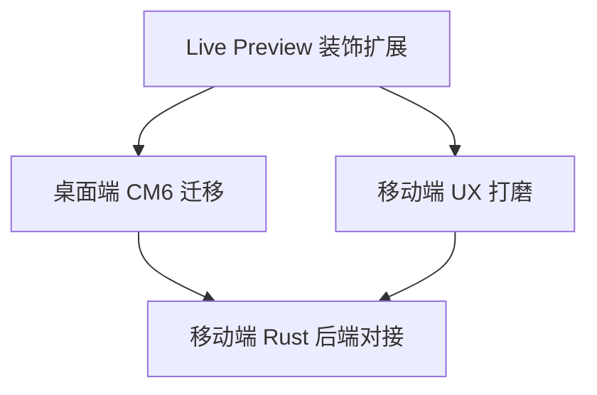

# v0.2.0 - 编辑器核心能力

> 完成从 BlockNote 到 CodeMirror 6 的编辑器架构迁移，实现 Markdown Live Preview、双端共享编辑器、yjs 实时协作对接 Rust 后端，并打磨移动端编辑体验。

## 目标

这个版本完成后：

- 移动端拥有一个功能完整的 Markdown 编辑器，支持 Live Preview（Obsidian 风格）
- 编辑器核心代码（`@swarmnote/editor`）桌面端和移动端 100% 共享
- yjs CRDT 协作链路打通：移动端编辑 → WebView Y.Doc → Rust 持久化 → P2P 广播
- 桌面端完成从 BlockNote 到 CM6 的迁移，旧文档无损迁移
- 移动端编辑体验接近 Joplin/Obsidian 水平（格式化工具栏、键盘适配等）

**产品定位转变**：从"Notion 式 block 笔记"→"Obsidian 式 Markdown Live Preview 笔记"。

## 范围

### 包含

- Markdown Live Preview 装饰扩展（CM6 Decoration + CSS）
- 桌面端 BlockNote → CM6 迁移 + 数据迁移脚本
- 移动端 Rust 后端对接（uniffi yjs 同步链路）
- 移动端编辑器 UX 打磨（工具栏、键盘、暗色模式等）

### 不包含（推迟到后续版本）

- Obsidian 特有 Markdown 方言（wikilinks、embeds、callouts）
- KaTeX 数学公式渲染（可选，视进度加入）
- 多人实时光标（Awareness）
- 文件树 / 工作区管理
- 设备配对 / P2P 发现

## 功能清单

### 依赖关系

| 层级 | 功能 | 可并行 |
| ---- | ---- | ------ |
| L0（无依赖） | Live Preview 装饰扩展 | 独立开发 |
| L1（依赖 L0） | 桌面端 CM6 迁移、移动端 UX 打磨 | 两者可并行 |
| L2（依赖 L1） | 移动端 Rust 后端对接 | 依赖桌面端迁移完成（统一 yjs schema） |

### 功能清单

| 功能 | 优先级 | 依赖 | Feature 文档 | Issue |
| ---- | ------ | ---- | ------------ | ----- |
| Live Preview 装饰扩展 | P0 | - | [link](features/live-preview.md) | #17 |
| 桌面端 CM6 迁移 | P0 | Live Preview | [link](features/desktop-migration.md) | #17 |
| 移动端 Rust 后端对接 | P0 | 桌面端迁移 | [link](features/mobile-rust-sync.md) | #17 |
| 移动端 UX 打磨 | P1 | Live Preview | [link](features/mobile-ux-polish.md) | #17 |

> 注：以上功能均为 #17 的子任务，后续可拆分为独立 Issue。

## 前置条件（v0.1.0 + 已完成工作）

以下基础设施已在 v0.1.0 及后续开发中完成：

- [x] `@swarmnote/editor` 平台无关编辑器包（`packages/editor/`）
- [x] `@swarmnote/editor-web` WebView IIFE bundle 包（`packages/editor-web/`）
- [x] Comlink WebView Endpoint 适配器（替代 Joplin AGPLv3 的 RemoteMessenger）
- [x] `useEditorBridge` Hook + `MarkdownEditor` 组件
- [x] `y-codemirror.next` 集成（WebView 内 Y.Doc ↔ CM6 双向绑定）
- [x] Android IME `EDIT_CONTEXT=false` workaround
- [x] 构建管线：tsdown IIFE → codegen CJS 字符串 → Metro require 注入

## 验收标准

- [ ] 移动端编辑器支持 Markdown Live Preview（标题、粗体、斜体、代码块、链接等可视化渲染）
- [ ] 桌面端完成 CM6 切换，旧 BlockNote 文档全部无损迁移为 Y.Text
- [ ] 移动端编辑内容可通过 uniffi → Rust → P2P 同步到桌面端
- [ ] 格式化工具栏可用（加粗、斜体、标题、代码等常用操作）
- [ ] 亮色/暗色模式下编辑器主题正确切换
- [ ] Android 中文输入正常（IME composition 无丢字/崩溃）
- [ ] `pnpm lint` 无错误，TypeScript 编译通过

## 技术选型

| 领域 | 选择 | 备注 |
| ---- | ---- | ---- |
| 编辑器 | **CodeMirror 6** | 替代 BlockNote，参考 Joplin 架构 |
| Live Preview | **Lezer AST + CM6 Decoration + CSS** | 标准模式，Obsidian/Joplin/HyperMD 均采用 |
| 跨 WebView RPC | **Comlink**（Apache 2.0） | 替代 Joplin 的 RemoteMessenger（AGPLv3） |
| yjs ↔ CM6 | **y-codemirror.next** | yjs 作者维护，字符级 CRDT 开箱即用 |
| yjs schema | **单个 Y.Text** | 替代 BlockNote 的 XML schema，Rust 侧用 yrs 原生 API |
| Markdown 方言 | **GFM**（GitHub Flavored Markdown） | 后续按需扩展 Obsidian 特性 |

## 依赖与风险

- **风险**：桌面端数据迁移（BlockNote Y.Doc → Y.Text）可能导致 CRDT 历史重置
- **缓解**：格式升级时重置历史可接受，用 `yrs_blocknote::doc_to_markdown()` 做一次性迁移
- **风险**：CM6 Widget Decoration 实现 Image/Video 块级渲染工作量较大
- **缓解**：Phase 1 先只读渲染，交互编辑（缩放、caption）后续版本补充
- **风险**：WebView 内 yjs JS 库在大文档场景下的性能
- **缓解**：通过 Uint8Array 增量 update 传输而非全量同步，控制单次 update 体积

## 参考资料

- 架构设计文档：[`dev-notes/blog/editor-architecture-cm6-joplin.md`](../../dev-notes/blog/editor-architecture-cm6-joplin.md)
- Comlink 集成博客：[`dev-notes/blog/comlink-codemirror-rn-integration.md`](../../dev-notes/blog/comlink-codemirror-rn-integration.md)
- Joplin `@joplin/editor`：架构参考（AGPLv3，只参考不复制代码）
- [CodeMirror 6 官方文档](https://codemirror.net/)
- [y-codemirror.next](https://github.com/yjs/y-codemirror.next)
- [Comlink](https://github.com/nicolo-ribaudo/comlink)

## 时间线

- 开始日期：2026-04-12
- 目标发布日期：不设截止日期，按节奏推进
